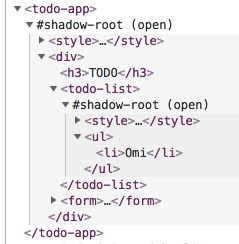
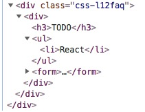
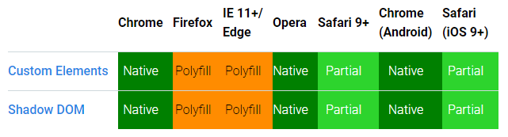

[English](./README.md) | 简体中文

# Omi - 合一  

> 下一代 Web 框架，去万物糟粕，合精华为一。

<p align="center"></p>

### 特性

- 4KB 的代码尺寸，比小更小
- 顺势而为，顺从浏览器的发展和 API 设计
- Webcomponents + JSX 相互融合为一个框架 Omi
- Webcomponents 也可以数据驱动视图, UI = fn(data)
- JSX 是开发体验最棒(智能提示)、[语法噪音最少](https://github.com/facebook/jsx#why-not-template-literals)的 UI 表达式
- 独创的 Path Updating 机制，基于 Proxy 全自动化的精准更新，功耗低，自由度高，性能卓越，方便集成 requestIdleCallback 
- 使用 store 系统不需要调用 this.udpate，它会自动化按需更新局部视图
- 看看[Facebook React 和 Web Components对比优势](https://www.cnblogs.com/rubylouvre/p/4072979.html)，Omi 融合了各自的优点，而且给开发者自由的选择喜爱的方式
- Shadow DOM 与 Virtual DOM 融合，Omi 既使用了虚拟 DOM，也是使用真实 Shadow DOM，让视图更新更准确更迅速
- 类似 WeStore 体系，99.9% 的项目不需要什么时间旅行,也不仅仅 redux 能时间旅行,请不要上来就 redux，Omi store 体系可以满足所有项目
- 局部 CSS 最佳解决方案(Shadow DOM)，社区为局部 CSS 折腾了不少框架和库(使用js或json写样式，如:Radium，jsxstyle，react-style；与webpack绑定使用生成独特的className`文件名—类名—hash值`，如：CSS Modules，Vue)，都是 hack 技术；Shadow DOM Style 是最完美的方案

对比同样开发 TodoApp， Omi 和 React 渲染完的 DOM 结构:

 

左边是Omi，右边是 React，Omi 使用 Shadow DOM 隔离样式和语义化结构。

---

- [一个 HTML 完全上手](#一个-html-完全上手)
- [Getting Started](#getting-started)
    - [Install](#install)
	- [Hello Element](#hello-element)
    - [TodoApp](#todoapp)
    - [Store](#store)
	- [生命周期](#生命周期)
- [文档](https://github.com/Tencent/omi/blob/master/docs/main-concepts.cn.md)
- [生态](#生态)
- [浏览器兼容](#浏览器兼容)
- [Links](#links)
- [License](#license)

## 一个 HTML 完全上手

下面这个页面不需要任何构建工具就可以执行

* [点击这里看执行结果](https://tencent.github.io/omi/assets/)。
* [Omi.js CDN](https://unpkg.com/omi)

```html
<!DOCTYPE html>
<html>

<head>
  <meta charset="UTF-8" />
  <title>Add Omi in One Minute</title>
</head>

<body>
  <script src="https://unpkg.com/omi"></script>
  <script>
    const { WeElement, h, render, define } = Omi

    class LikeButton extends WeElement {
      install() {
        this.data = { liked: false }
      }

      render() {
        if (this.data.liked) {
          return 'You liked this.'
        }

        return h(
          'button',
          {
            onClick: () => {
              this.data.liked = true
              this.update()
            }
          },
          'Like'
        )
      }
    }

    define('like-button', LikeButton)

    render(h('like-button'), 'body')
  </script>
</body>

</html>
```

## Getting Started

### Install

```bash
$ npm i omi-cli -g               # install cli
$ omi init your_project_name     # init project, you can also exec 'omi init' in an empty folder
$ cd your_project_name           # please ignore this command if you executed 'omi init' in an empty folder
$ npm start                      # develop
$ npm run build                  # release
```

Cli 自动创建的项目脚手架是基于单页的 create-react-app 改造成多页的，有配置方面的问题可以查看 [create-react-app 用户指南](https://github.com/facebook/create-react-app/blob/master/packages/react-scripts/template/README.md)。

### Hello Element

先创建一个自定义元素:

```js
import { tag, WeElement, render } from 'omi'

@tag('hello-element')
class HelloElement extends WeElement {

    onClick = (evt) => {
        //trigger CustomEvent
        this.fire('abc', { name : 'dntzhang', age: 12 })
        evt.stopPropagation()
    }

    css() {
        return `
         div{
             color: red;
             cursor: pointer;
         }`
    }

    render(props) {
        return (
            <div onClick={this.onClick}>
                Hello {props.msg} {props.propFromParent}
                <div>Click Me!</div>
            </div>
        )
    }   
}
```

使用该元素:

``` js
import { tag, WeElement, render } from 'omi'
import './hello-element'

@tag('my-app')
class MyApp extends WeElement {
    static get data() {
        return { abc: '', passToChild: '' }
    }

    //bind CustomEvent 
    onAbc = (evt) => {
        // get evt data by evt.detail
        this.data.abc = ' by ' + evt.detail.name
        this.update()   
    }

    css() {
        return `
         div{
             color: green;
         }`
    }

    render(props, data) {
        return (
            <div>
                Hello {props.name} {data.abc}
                <hello-element onAbc={this.onAbc} prop-from-parent={data.passToChild} msg="WeElement"></hello-element>
            </div>
        )
    }
}

render(<my-app name='Omi v4.0'></my-app>, 'body')
```

告诉 Babel 把 JSX 转化成 Omi.h() 的调用:

``` json
{
    "presets": ["env", "omi"]
}
```

需要安装下面两个 npm 包支持上面的配置:

``` bash
"babel-preset-env": "^1.6.0",
"babel-preset-omi": "^0.1.1",
```

如果不想把 css 写在 js 里，你可以使用 [to-string-loader](https://www.npmjs.com/package/to-string-loader), 比如下面配置:

``` js
{
    test: /[\\|\/]_[\S]*\.css$/,
    use: [
        'to-string-loader',
        'css-loader'
    ]
}
```

如果你的 css 文件以 `_` 开头, css 会使用 to-string-loader. 如：

``` js
import { tag, WeElement render } from 'omi'
//typeof cssStr is string
import cssStr from './_index.css' 

@tag('my-app')
class MyApp extends WeElement {

  css() {
    return cssStr
  }
  ...
  ...
  ...
```

### TodoApp

下面列举一个相对完整的 TodoApp 的例子:

```js
import { tag, WeElement, render } from 'omi'

@tag('todo-list')
class TodoList extends WeElement {
    render(props) {
        return (
            <ul>
                {props.items.map(item => (
                    <li key={item.id}>{item.text}</li>
                ))}
            </ul>
        );
    }
}

@tag('todo-app')
class TodoApp extends WeElement {
    static get data() {
        return { items: [], text: '' }
    }

    render() {
        return (
            <div>
                <h3>TODO</h3>
                <todo-list items={this.data.items} />
                <form onSubmit={this.handleSubmit}>
                    <input
                        id="new-todo"
                        onChange={this.handleChange}
                        value={this.data.text}
                    />
                    <button>
                        Add #{this.data.items.length + 1}
                    </button>
                </form>
            </div>
        );
    }

    handleChange = (e) => {
        this.data.text = e.target.value
    }

    handleSubmit = (e) => {
        e.preventDefault();
        if (!this.data.text.trim().length) {
            return;
        }
        this.data.items.push({
            text: this.data.text,
            id: Date.now()
        })
        this.data.text = '';
	this.update()
    }
}

render(<todo-app></todo-app>, 'body')
```

### Store

使用 Store 体系可以告别 update 方法，基于 Proxy 的全自动属性追踪和更新机制。强大的 Store 体系是高性能的原因，除了靠 props 决定组件状态的组件，其余组件所有 data 都挂载在 store 上,

```js
export default {
  data: {
    items: [],
    text: '',
    firstName: 'dnt',
    lastName: 'zhang',
    fullName: function () {
      return this.firstName + this.lastName
    },
    globalPropTest: 'abc', //更改我会刷新所有页面,不需要再组件和页面声明data依赖
    ccc: { ddd: 1 } //更改我会刷新所有页面,不需要再组件和页面声明data依赖
  },
  globalData: ['globalPropTest', 'ccc.ddd'],
  add: function () {
    if (!this.data.text.trim().length) {
        return;
    }
    this.data.items.push({
      text: this.data.text,
      id: Date.now()
    })
    this.data.text = ''
  }
  //默认 false，为 true 会无脑更新所有实例
  //updateAll: true
}
```

自定义 Element 需要声明依赖的 data，这样 Omi store 根据自定义组件上声明的 data 计算依赖 path 并会按需局部更新。如:

```js
class TodoApp extends WeElement {
    static get data() {
        //如果你用了 store，这个只是用来声明依赖，按需 Path Updating
        return { items: [], text: '' }
    }
    ...
    ...
    ...
    handleChange = (e) => {
        this.store.data.text = e.target.value
    }

    handleSubmit = (e) => {
        e.preventDefault()
        this.store.add()
    }
}
```

* 数据的逻辑都封装在了 store 定义的方法里 (如 store.add)
* 视图只负责传递数据给 store （如上面调用 store.add 或设置 store.data.text）

需要在 render 的时候从根节点注入 store 才能在所有自定义 Element 里使用 this.store:

```js
render(<todo-app></todo-app>, 'body', store)
```

[→ Store 完整的代码](https://github.com/Tencent/omi/blob/master/packages/omi/examples/store/main.js)

总结一下:

* store.data 用来列出所有属性和默认值(除去 props 决定的视图的组件)
* 组件和页面的 data 用来列出依赖的 store.data 的属性 (omi会记录path)，按需更新
* 如果页面简单组件很少，可以 updateAll 设置成 true，并且组件和页面不需要声明 data，也就不会按需更新
* globalData 里声明的 path，只要修改了对应 path 的值，就会刷新所有页面和组件，globalData 可以用来列出所有页面或大部分公共的属性 Path

### 生命周期

| Lifecycle method            | When it gets called                              |
|-------------------------------|--------------------------------------------------|
| `install`        | before the component gets mounted to the DOM     |
| `installed`         | after the component gets mounted to the DOM      |
| `uninstall`      | prior to removal from the DOM                    |
| `beforeUpdate`       | before `render()`                                |
| `afterUpdate`        | after `render()`                                 |

## 生态

* [https://www.webcomponents.org/](https://www.webcomponents.org/)
* [https://www.webcomponents.org/elements](https://www.webcomponents.org/elements)

在里面查找你想要的组件，直接使用，或者花几分钟就能转换成 Omi Element（把模板拷贝到 render 方法，style拷贝到 css 方法）。

## 浏览器兼容

Omi 4.0+ works in the latest two versions of all major browsers: Safari 10+, ~~IE 11+~~, and the evergreen Chrome, Firefox, and Edge.



[→ polyfills](https://github.com/webcomponents/webcomponentsjs)

## Links

- [westore](https://github.com/dntzhang/westore)
- [omijs.org](http://omijs.org/)

## License

MIT © Tencent 

Please contact me[@dntzhang](https://github.com/dntzhang) for any questions. 
