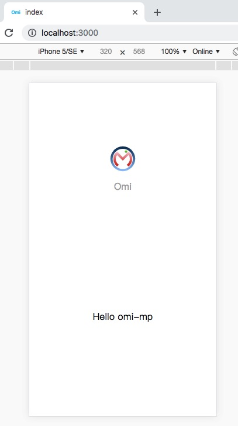
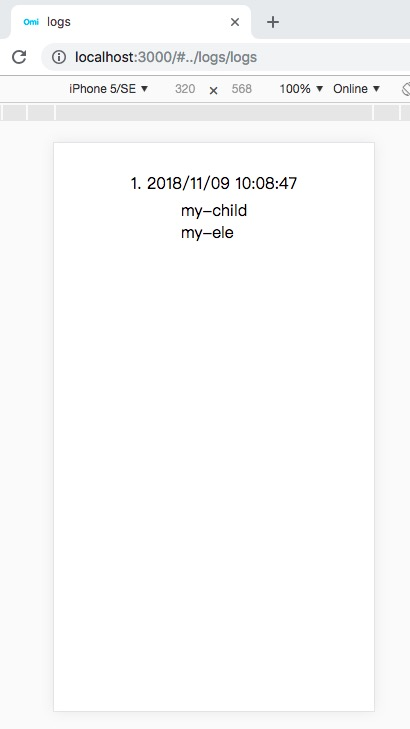
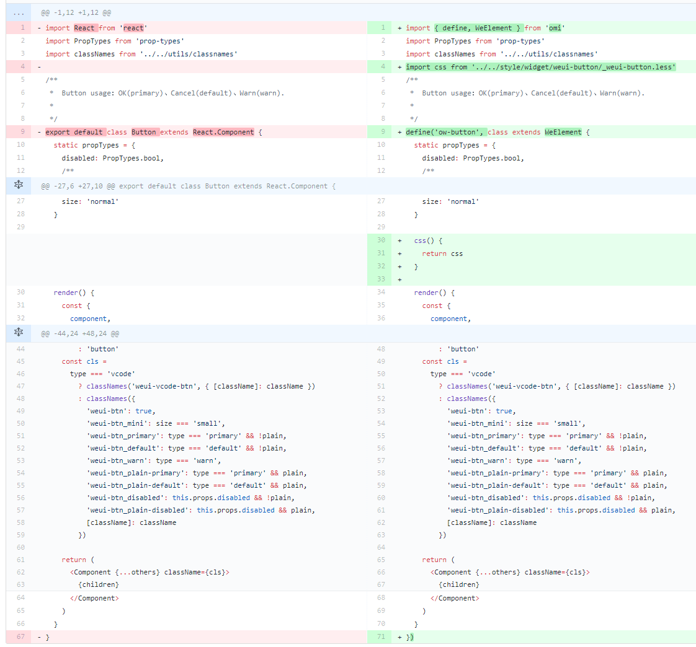

English | [简体中文](./README.CN.md) | [한국어](./README.KR.md)

<p align="center"></p>
<h2 align="center">Omi: Next Generation Web Framework in 4kb JavaScript</h2>
<p align="center"><b>Merge JSX, Web Components, Proxy, Store, Path Updating together</b></p>

## Why Omi?

- Tiny size. _(**4kb** gzipped)_
- Supports TypeScript.
- Reactive data-binding
- Enhanced CSS, [rpx unit support](https://github.com/Tencent/omi/releases/tag/v4.0.26) base on **750** screen width
- [Based on Shadow DOM](https://developers.google.com/web/fundamentals/web-components/shadowdom)
- Easy to debug via [Omi DevTools Extension](https://github.com/f/omi-devtools) [[Install from Chrome WebStore](https://chrome.google.com/webstore/detail/omijs-devtools/pjgglfliglbhpcpalbpeloghnbceocmd)]
- Compliance with browser trend and API design.
- Merge [**Web Components**](https://developers.google.com/web/fundamentals/web-components/) and [**JSX**](https://reactjs.org/docs/introducing-jsx.html)  into one framework.
- Built in observe feature (No need to call `this.update()`).
- Web Components can also be a data-driven view, **`UI = fn(data)`**.
- JSX is the best development experience (code intelligent completion and tip) UI Expression with least [grammatical noise](https://github.com/facebook/jsx#why-not-template-literals) and it's turing complete(template engine is not, es template string is but grammatical noise is too loud).
- The original **Path Updating** system. Proxy-based automatic **accurate** update, **low power consumption**, high degree of freedom, excellent performance, easy integration of `requestIdleCallback`
- Say goodbye to `this.update` method when using **store system**! It will automatically update UI partially when data is changed.
- Look at [Facebook React vs Web Components](https://softwareengineering.stackexchange.com/questions/225400/pros-and-cons-of-facebooks-react-vs-web-components-polymer)，Omi **combines their advantages** and gives developers the **freedom to choose the way they like**.
- **Shadow DOM merges with Virtual DOM**, Omi uses both virtual DOM and real Shadow DOM to make view updates more accurate and faster.
- With a Store system, 99.9% of projects don't need time travel, and not only Redux can travel, please don't come up on Redux, Omi store system can meet all projects
- **Scoped CSS**'s best solution is **Shadow DOM**, the community churning out frameworks and libraries for Scoped CSS (using JS or JSON writing styles such as Radium, jsxstyle, react-style; binding to webpack using generated unique `className` `filename-classname-hash`, such as CSS Modules, Vue), are hack technologies; _and Shadow DOM Style is the perfect solution_.

Compare TodoApp by Omi and React, Omi and React rendering DOM structure:

| **Omi**                         | **React**                           |
| ------------------------------- | ----------------------------------- |
|  |  |

Omi uses Shadow DOM based style isolation and semantic structure.

## Ecosystem of Omi

| **Project**                         | **Description**                           |
| ------------------------------- | ----------------------------------- |
| [omi-docs](https://github.com/Tencent/omi/blob/master/docs/main-concepts.md)| Omi official documents |
| [omi-mp ](https://github.com/Tencent/omi/tree/master/packages/omi-mp)| Develop and generate Web HTML5 Single-Page Applications by wechat mini program.|
| [omi-router ](https://github.com/Tencent/omi/tree/master/packages/omi-router) |Omi official router. [→ DEMO](https://tencent.github.io/omi/packages/omi-router/examples/spa/build/) |
| [omi-devtools](https://github.com/f/omi-devtools)| Browser DevTools extension |
| [omi-cli](https://github.com/Tencent/omi/tree/master/packages/omi-cli)| Project scaffolding |
| [omi-transform](https://github.com/Tencent/omi/tree/master/packages/omi-transform)|Omi / [css3transform](https://tencent.github.io/omi/packages/omi-transform/css3transform/) integration. Made css3 transform super easy in your Omi project.|
| [omi-tap2 ](https://github.com/Tencent/omi/releases/tag/v4.0.24)| Native tap event support(omi v4.0.24+）|
| [omi-tap](https://github.com/Tencent/omi/tree/master/packages/omi-tap)|Support tap event in your omi project|
| [omi-finger](https://github.com/Tencent/omi/tree/master/packages/omi-finger)|Support touch and gesture events in your Omi project.|
| [omi-touch](https://github.com/Tencent/omi/tree/master/packages/omi-touch)|Smooth scrolling, rotation, pull to refresh and any motion for the web.|
| [omi-mobx](https://github.com/Tencent/omi/tree/master/packages/omi-mobx)|Omi Mobx Adapter|
| [omi-use](https://github.com/Tencent/omi/blob/master/docs/main-concepts.md#use)|React hooks like API|
| [omi-native](https://github.com/Tencent/omi/tree/master/packages/omi-native)|Render web components to native|
| [omi-weui](https://github.com/Tencent/omi/tree/master/packages/omi-weui) working |Weui for Omi by [@132yse](https://github.com/132yse).|
|[omi-i18n](https://github.com/i18next/omi-i18n)| Internationalization solution for omi.js using i18next ecosystem |
| [omi-page](https://github.com/Tencent/omi/tree/master/packages/omi-page) |Tiny client-side router by [page](https://github.com/visionmedia/page.js)|

## omi-mp

> Through Wechat Mini Program, develop HTML5 SPA and onclick generate Web (Based on omi + [omi-router](https://github.com/Tencent/omi/tree/master/packages/omi-router))

Conversion example of the official template:

| **Index**                         | **Logs**                           |
| ------------------------------- | ----------------------------------- |
|| |

Because in the web cannot take the user login state, the user avatar and name are replaced.

## Useful Resources

* [Shadow Dom In Depth](https://github.com/praveenpuglia/shadow-dom-in-depth)
* [60FPS Animation In Omi](https://github.com/Tencent/omi/blob/master/tutorial/omi-transform.md)
* [Render Web Components To Native](https://github.com/Tencent/omi/blob/master/tutorial/render-web-components-to-native.md)
* [Web Components MDN](https://developer.mozilla.org/en-US/docs/Web/Web_Components)
* [Web Components Google](https://developers.google.com/web/fundamentals/web-components/)
* [Web Components Org](https://www.webcomponents.org/introduction)
* [Proxy MDN](https://developer.mozilla.org/en-US/docs/Web/JavaScript/Reference/Global_Objects/Proxy)
* [CSS Variables](https://developer.mozilla.org/en-US/docs/Web/CSS/Using_CSS_variables)
* [CSS Shadow Parts](https://drafts.csswg.org/css-shadow-parts-1/)
* [Part Theme Explainer](https://meowni.ca/posts/part-theme-explainer/)
* [Platform HTML5](https://platform.html5.org/)

---

# Overview of the Readme

- [Ecosystem of Omi](#ecosystem-of-omi)
- [omi-mp](#omi-mp)
- [Useful Resources](#useful-resources)
- [Add Omi in One Minute](#add-omi-in-one-minute)
- [Add Omi in 30 Seconds](#add-omi-in-30-seconds)
- [Getting Started](#getting-started)
  - [Install](#install)
  - [Hello Element](#hello-element)
  - [TodoApp](#todoapp)
  - [Store](#store)
  - [Observe](#observe)
  - [Lifecycle](#lifecycle)
- [Debugging](#debugging)
- [React to Omi](#react-to-omi)
- [Browsers Support](#browsers-support)
- [Q & A](#q--a)
- [Thanks](#thanks)
- [License](#license)

## Add Omi in One Minute

This page demonstrates using Omi **with no build tooling**.

- [Online Demo!](https://tencent.github.io/omi/assets/)
- [Omi.js CDN](https://unpkg.com/omi)

```html
<!DOCTYPE html>
<html>

<head>
  <meta charset="UTF-8" />
  <title>Add Omi in One Minute</title>
</head>

<body>
  <script src="https://unpkg.com/omi"></script>
  <script>
    const { WeElement, h, render, define } = Omi

    define('like-button',
      class extends WeElement {
        install() {
          this.data = { liked: false }
        }

        render() {
          if (this.data.liked) {
            return 'You liked this.'
          }

          return h(
            'button',
            {
              onClick: () => {
                this.data.liked = true
                this.update()
              }
            },
            'Like'
          )
        }
      })

    render(h('like-button'), 'body')
  </script>
</body>

</html>
```

You can also use `like-button` tag directly in HTML：

```jsx
<body>
  <like-button />
</body>
```

### Add Omi in 30 Seconds

You can also quickly build omi projects using modern JS code:

```js
import { render, WeElement, tag, observe } from "omi"

@observe
@tag("my-counter")
class MyCounter extends WeElement {

  data = {
    count: 0
  }

  sub = () => {
    this.data.count--
  }

  add = () => {
    this.data.count++
  }

  render() {
    return (
      <div>
        <button onClick={this.sub}>-</button>
        <span>{this.data.count}</span>
        <button onClick={this.add}>+</button>
      </div>
    )
  }
}

render(<my-counter />, "body")
```

[→ counter demo](https://tencent.github.io/omi/packages/omi/examples/counter/)

You will find that the `MyCounter` class name defined above is never used. So you can also use the following way to avoid Eslint hints:

```js
import { render, WeElement, define } from 'omi'

define('my-counter', class extends WeElement {
    static observe = true
    
    data = {
      count: 1
    }

    sub = () => {
      this.data.count--
    }

    add = () => {
      this.data.count++
    }

    render() {
      return (
        <div>
          <button onClick={this.sub}>-</button>
          <span>{this.data.count}</span>
          <button onClick={this.add}>+</button>
        </div>
      )
    }
  })

render(<my-counter />, 'body')
```

You can also be defined as a form of pure functions:

```js
import { define, render } from 'omi'

define('my-counter', function() {
  const [count, setCount] = this.use({
    data: 0,
    effect: function() {
      document.title = `The num is ${this.data}.`
    }
  })

  this.useCss(`button{ color: red; }`)

  return (
    <div>
      <button onClick={() => setCount(count - 1)}>-</button>
      <span>{count}</span>
      <button onClick={() => setCount(count + 1)}>+</button>
    </div>
  )
})

render(<my-counter />, 'body')
```

If you don't need effect, you can use `useData` directly:

```js
const [count, setCount] = this.useData(0)
```

## Getting Started

### Install

```bash
$ npm i omi-cli -g               # install cli
$ omi init your_project_name     # init project, you can also exec 'omi init' in an empty folder
$ cd your_project_name           # please ignore this command if you executed 'omi init' in an empty folder
$ npm start                      # develop
$ npm run build                  # release
```

Directory description:

```
├─ config
├─ public
├─ scripts
├─ src
│  ├─ assets
│  ├─ elements    //Store all custom elements
│  ├─ store       //Store all this store of pages
│  ├─ admin.js    //Entry js of compiler，will build to admin.html
│  └─ index.js    //Entry js of compiler，will build to index.html
```

About compiled website URL：

* [build env doc](https://facebook.github.io/create-react-app/docs/adding-custom-environment-variables#referencing-environment-variables-in-the-html)
* [build problem](https://stackoverflow.com/questions/42686149/create-react-app-build-with-public-url)

Such as in windows:

```json
"scripts": {
  "start": "node scripts/start.js",
  "_build": "node scripts/build.js",
  "build":"set PUBLIC_URL=https://fe.wxpay.oa.com/dv&& npm run _build"
}
```

In mac os:

```json
"scripts": {
    "start": "node scripts/start.js",
    "_build": "node scripts/build.js",
    "build":"PUBLIC_URL=https://fe.wxpay.oa.com/dv npm run _build",
    "fix": "eslint src --fix"
  },
```

TypeScript Template(omi-cli v3.0.5+):

```bash
$ omi init-ts your_project_name    
```

[SPA Template](https://tencent.github.io/omi/packages/omi-router/examples/spa/build/)(omi-cli v3.0.10+):

```bash
$ omi init-spa your_project_name    
```

omi-mp Template(omi-cli v3.0.13+):

```bash
$ omi init-mp your_project_name    
```

CLI's auto-created project scaffolding is based on a single-page create-react-app to be converted into a multi-page one, with configuration issues to see [create-react-app user guide](https://facebook.github.io/create-react-app/docs/getting-started)

### Hello Element

Define a custom element by extending **`WeElement`** base class:

```js
import { define, WeElement } from 'omi'

define('hello-element', class extends WeElement {
  onClick = evt => {
    // trigger CustomEvent
    this.fire('abc', { name: 'dntzhang', age: 12 })
    evt.stopPropagation()
  }

  css() {
    return `
        div {
          color: red;
          cursor: pointer;
        }`
  }

  render(props) {
    return (
      <div onClick={this.onClick}>
        Hello {props.msg} {props.propFromParent}
        <div>Click Me!</div>
      </div>
    )
  }
})
```

Using `hello-element`:

```js
import { define, render, WeElement } from 'omi'
import './hello-element'

define('my-app', class extends WeElement {
  data = { abc: 'abc', passToChild: 123 }

  // define CustomEvent Handler
  onAbc = evt => {
    // get evt data by evt.detail
    this.data.abc = ' by ' + evt.detail.name
    this.data.passToChild = 1234
    this.update()
  }

  css() {
    return `
         div{
             color: green;
         }`
  }

  render(props, data) {
    return (
      <div>
        Hello {props.name} {data.abc}
        <hello-element
          onAbc={this.onAbc}
          prop-from-parent={data.passToChild}
          msg="WeElement"
        />
      </div>
    )
  }
})

render(<my-app name="Omi v4.0" />, 'body')
```

Tell Babel to transform JSX into `Omi.h()` call:

```json
{
  "presets": ["env", "omi"]
}
```

The following two NPM packages need to be installed to support the above configuration:

```bash
"babel-preset-env": "^1.6.0",
"babel-preset-omi": "^0.1.1",
```

If you use babel7, you can also use the following packages and configuration:

```bash
npm install --save-dev @babel/preset-env
npm install --save-dev @babel/preset-react
```

```js
{
  "presets": [
    "@babel/preset-env",
    [
      "@babel/preset-react",
      {
        "pragma": "Omi.h", 
      }
    ]
  ]
}
```

If you don't want to write CSS in JS, you can use [to-string-loader](https://www.npmjs.com/package/to-string-loader) of webpack,
For example, the following configuration:

```js
{
  test: /[\\|\/]_[\S]*\.css$/,
  use: [
    'to-string-loader',
    'css-loader'
  ]
}
```

If your CSS file starts with "`_`", CSS will use `to-string-loader`., such as:

```js
import { tag, WeElement render } from 'omi'

// typeof cssStr is string
import cssStr from './_index.css'

@tag('my-app')
class MyApp extends WeElement {

  css() {
    return cssStr
  }
  ...
  ...
  ...
```

You can also forget the tedious configuration and use omi-cli directly, no need to configure anything.

### TodoApp

Here is a relatively complete example of TodoApp:

```js
import { define, render, WeElement } from 'omi'

define('todo-list', function(props) {
  return (
    <ul>
      {props.items.map(item => (
        <li key={item.id}>{item.text}</li>
      ))}
    </ul>
  )
})

define('todo-app', class extends WeElement {
  static observe = true

  data = { items: [], text: '' }

  render() {
    return (
      <div>
        <h3>TODO</h3>
        <todo-list items={this.data.items} />
        <form onSubmit={this.handleSubmit}>
          <input
            id="new-todo"
            onChange={this.handleChange}
            value={this.data.text}
          />
          <button>Add #{this.data.items.length + 1}</button>
        </form>
      </div>
    )
  }

  handleChange = e => {
    this.data.text = e.target.value
  }

  handleSubmit = e => {
    e.preventDefault()
    if (!this.data.text.trim().length) {
      return
    }
    this.data.items.push({
      text: this.data.text,
      id: Date.now()
    })
    this.data.text = ''
  }
})

render(<todo-app />, 'body')
```

### Store

Say goodbye to `this.update` method when using store system! It will automatically update the UI partially when data is changed. The powerful **Store architecture** is high-performanced since all the data is mounted on the store, except for components that rely on props to determine the state of the component.

```js
export default {
  data: {
    items: [],
    text: "",
    firstName: "dnt",
    lastName: "zhang",
    fullName: function() {
      return this.firstName + this.lastName;
    },
    globalPropTest: "abc", // Change it will refresh all elements without changing the components and page declaring data dependency.
    ccc: { ddd: 1 } // Change it will refresh all elements without changing the components and page declaring data dependency.
  },
  globalData: ["globalPropTest", "ccc.ddd"],
  add: function() {
    if (!this.data.text.trim().length) {
      return;
    }
    this.data.items.push({
      text: this.data.text,
      id: Date.now()
    });
    this.data.text = "";
  }
  // Default value is false, set to true will update all instances when data changing.
  // updateAll: true
};
```

Custom Element requires declaring dependent data so that Omi stores compute the dependency path based on the data declared on the custom component and update it locally as needed. Such as:

```js
define('todo-app', class extends WeElement {
  // If you use store, the data is only used to declare dependencies.
  static get data() {
    return { items: [], text: "" };
  }
  // ...
  handleChange = e => {
    this.store.data.text = e.target.value;
  };

  handleSubmit = e => {
    e.preventDefault();
    this.store.add();
  };
})
```

- The logic of data is **encapsulated in the store definition method** (such as `store.add`).
- Views are only **responsible for passing data to store**, such as calling `store.add` or setting `store.data.text` on top.

You need to inject `store` from the root node at render time to use this store:

```js
render(<todo-app />, "body", store);
```

[→ Store Source Code](https://github.com/Tencent/omi/blob/master/packages/omi/examples/store/main.js)

#### Summary：

- `store.data` is used to list all attributes and default values (except the components of the view decided by props).
- The static data of the element is used to list the attributes of the dependent store.data _(Omi will record path)_ and update on demand.
- If there are few simple components on the page, `updateAll` can be set to `true`, and components and pages don't need to declare data, and they don't update on demand
- The path declared in `globalData` refreshes all pages and components by modifying the value of the corresponding path, which can be used to list all pages or most of the public properties path

## Observe

### Omi Observe

You can also use observe to create response views for element who no need `store`, such as:

```js
import { define, WeElement } from "omi"

define("my-app", class extends WeElement {
  static observe = true

  install() {
    this.data.name = "omi"
  }

  onClick = () => {
    this.data.name = "Omi V4.0"
  }

  render(props, data) {
    return (
      <div onClick={this.onClick}>
        <h1>Welcome to {data.name}</h1>
      </div>
    )
  }
})
```

It should be noted that if `observe` is used, do not set the value of data in some of the following functions: some complex objects such as obj or arr:

* render
* beforeRender
* beforeUpdate
* afterUpdate

Because data settings will simply compare the value before and after, complex objects will not be deep contrast, the contrast value will trigger different update, update will trigger the above function, infinite recursion.

For Example:

❌Wrong way:
```js
beforeRender(){
  this.data.a = { b: 1 }
}
```

✅ Right way:
```js
beforeRender(){
  this.data.a.b = 1 
}
```

If you want to be compatible with IE11, please use the `omi-mobx` instead of omi's own observe.

### Omi Mobx

```js
import { tag, WeElement } from "omi"
import { observe } from "omi-mobx"

@observe
@tag("my-app")
class MyApp extends WeElement {
  install() {
    this.data.name = "omi"
  }

  onClick = () => {
    this.data.name = "Omi V4.0"
  }

  render(props, data) {
    return (
      <div onClick={this.onClick}>
        <h1>Welcome to {data.name}</h1>
      </div>
    )
  }
}
```

### Lifecycle

| Lifecycle method | When it gets called                          |
| ---------------- | -------------------------------------------- |
| `install`        | before the component gets mounted to the DOM |
| `installed`      | after the component gets mounted to the DOM  |
| `uninstall`      | prior to removal from the DOM                |
| `beforeUpdate`   | before update                           |
| `afterUpdate`    | after update                             |
| `beforeRender`   | before `render()`                           |

## Debugging

Using [Omi DevTools](https://chrome.google.com/webstore/detail/omijs-devtools/pjgglfliglbhpcpalbpeloghnbceocmd) you can simply debug and manage your UI **without any configuration**. Just install and debug.

Since Omi uses Web Components and Shadow-DOM, it doesn't need to have another elements panel such as React or Vue has. It just adds a panel to the **Elements' sidebar** and it's powerful as much as React and Vue DevTools.


## React to Omi

For example, the below is about migration React button as weui Omi button:



* [Diff Split](https://github.com/Tencent/omi/commit/9790fadaaf20cfede80bcf9213756a83fc8c3949?diff=split)
* [Diff Unified](https://github.com/Tencent/omi/commit/9790fadaaf20cfede80bcf9213756a83fc8c3949?diff=unified)
* [Before](https://github.com/Tencent/omi/blob/c8af654f1d5865dc557c0b4b8ad524f702a69be5/packages/omi-weui/src/omi-weui/elements/button/button.js)
* [After](https://github.com/Tencent/omi/blob/9790fadaaf20cfede80bcf9213756a83fc8c3949/packages/omi-weui/src/omi-weui/elements/button/button.js)

## Browsers Support

Omi 4.0+ works in the latest two versions of all major browsers: Safari 10+, IE 11+, and the evergreen Chrome, Firefox, and Edge.


[→ Polyfills](https://github.com/webcomponents/webcomponentsjs)

> If you want to be compatible with IE11, use the Omi file of [→ this project](https://github.com/Tencent/omi/tree/master/packages/omi-ie11). This project uses JSON Diff + Timer instead of Proxy.

> You can dynamically load the JS of this project in the IE11 environment, and the proxy version is still used in other environments.

> You can also give up the store system and use omi-mobx to be compatible with IE11.

## Q & A 

- [@f](https://github.com/f)
- [@LeeHyungGeun](https://github.com/LeeHyungGeun)
- [@dntzhang](https://github.com/dntzhang)
- [@xcatliu](https://github.com/xcatliu)

Please contact us for any questions. Also, Add [Omi QQ Group](https://github.com/Tencent/omi/issues/169).

## Thanks

* [preact](https://github.com/developit/preact)
* [JSONPatcherProxy](https://github.com/Palindrom/JSONPatcherProxy)
* [create-react-app](https://github.com/facebook/create-react-app)
* [JSX](https://github.com/facebook/jsx)

## License

MIT © Tencent
