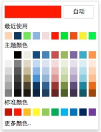

# color-picker

## More Version of README
[English Version](docs/README.en-us.md)


## 项目主页
点击[这里](https://zhangbobell.github.io/color-picker)查看 demo

## UI


## 特点
1. 简单易用，UI 和 Microsoft Word 2013 的拾色器一样；
2. 增加了「最近使用」的功能；
3. 在支持 html5 input[type='color'] 的浏览器实现了「更多颜色」的功能
4. 支持多语言, 目前支持: 简体中文(默认)[zh-cn], 英语美国[en-us]

## 获取
你可以直接下载 dist 目录里的 css 和 js 使用，比较快捷的方式是直接安装 bower 包：先安装 [bower](http://bower.io/)，然后运行 `bower install color-picker`；

## 用法
color-picker 基于 angular，

用法示例：
```javascript
<link rel="stylesheet" href="path/to/color-picker.min.css">

<script src="path/to/angular.js"></script>
<script src="path/to/color-picker.min.js"></script>

<!-- directive 的方式 -->
<font-color></font-color>

<!-- controller 的方式 -->
<div ng-controller="demoCtrl">
    <div color-picker set-color="dynamicSetColor()" class="font-color" ng-style="{'background-color': selectedForeColor}"></div>
</div>

<script>
    var myApp = angular.module('colorpickerDemo', ['ui.colorpicker']);

    // directive 的方式
    myApp.directive('fontColor', function() {
         return {
             restrict: 'E',
             scope:{},
             replace: false,
             template: '<div color-picker default-color="#ff0000" class="font-color" ng-style="{\'background-color\': selectedFontColor}"></div>',
             link: function(scope) {
                 scope.selectedFontColor = '#f00';

                 scope.$on('colorPicked', function(event, color) {
                     scope.selectedFontColor = color;
                 });
             }
         }
    })


    // controller 的方式
    myApp.controller('demoCtrl', function($scope) {
         $scope.selectedForeColor = dynamicSetColor();

         $scope.$on('colorPicked', function(event, color) {
             $scope.selectedForeColor = color;
         });

         // 动态设置默认颜色
         $scope.dynamicSetColor = dynamicSetColor;

         function dynamicSetColor() {
             return '#0f0';
         }

     });

</script>
```

## 配置
默认语言为简体中文(`zh-cn`), 目前还提供英语美国(`en-us`)的配置选项你可以通过如下方法配置默认语言:
```javascript
angular.module('colorpickerDemo', ['ui.colorpicker'])
    .config(function (localizeProvider) {
        localizeProvider.setDefaultLang('en-us');
    })
```
语言文件源文件在 `src/lang.service.js` 里面, 欢迎提供更多语言的版本, 提 Pull Request 即可.

## 选项
你可以通过在所在的元素上设置以下属性来配置 color-picker
 - `default-color`: 默认的颜色，如 `default-color="#ff0000"`
 - `disabled`: 是否可用，如 `disabled="disabled"`
 - `set-color`: 动态设置默认颜色函数，以达到不同的上下文环境具有不同的默认颜色。
 如 `set-color="dynamicSet()"`，则 `dynamicSet` 函数是可以根据上下文而设置的颜色。

## 事件
`colorPicked` -- 在用户选择了颜色的时候触发，在 color-picker 的父 scope 里面都可以监听到，带有一个参数 `color` （用户选择的颜色值）
