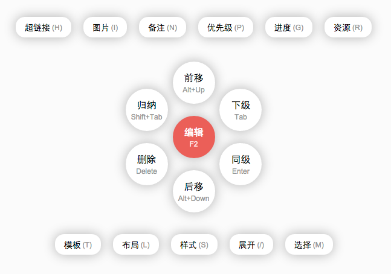

热盒 UI
====

热盒 UI 是一种高效的上下文交互方式，在最大化编辑区域的同时（再也不需要臃肿的工具栏了）允许全键盘操作。



## 使用示例

```js
var hotbox = new HotBox('#editor');

var main = hotbox.state('main');
main.button({
    position: 'center',
    action: function() {
        // 编辑动作
    },
    label: '编辑',
    key: 'F2',
    next: 'idle'
});

hotbox.active('main', { x: 300, y: 300 });
```

## HotBox 类

用于构建热盒 UI。

### 构造函数 `HotBox.constructor`

直接使用 `new` 关键字创建 HotBox 实例。

```js
var hotbox = new HotBox(selector);
```

构造函数接受一个**「必须」**的参数 `selector`，表示热盒渲染的位置。热盒创建之后的状态是 `idle`，这个状态下热盒是不可见的。

### 定义和获取状态 `state()` 方法

热盒在某个时刻有且只有一个状态（`state`），默认状态为 `idle`，此时热盒空闲，不会渲染，并且监听着按键，准备着进行定义的动作。用户需要通过 `state()` 方法来定义状态。

```js
var main = hotbox.state('main');
```

该方法需要指定一个状态名称，返回指定名称的 `HotBoxState` 对象，该对象可以用于进一步定义状态。

热盒会自动把 `main` 状态作为主要状态，会在 `idle` 状态下监听 `main` 状态定义的按键。建议用户定义并使用 `main` 状态。

### 设置热盒当前状态 `active()` 方法

热盒默认在 `idle` 状态上，使用 `active` 方法，使热盒进入指定的状态。

```js
hotbox.active('main', {x: 400, y: 400});
```

方法的完整签名为 `active(name, position)`。表示让热盒在 `position` 焦点位置渲染指定的状态。`position` 需要有 `x` 和 `y` 属性。

## HotBoxState 类

`HotBoxState` 类用户无法创建，调用 `HotBox` 的 `.state()` 方法时返回。

### 为状态添加按钮 `button()`

使用 `button()` 方法为状态添加一个按钮。

```js
var main = hotbox.state('main');
main.button({
    label: '编辑',
    key: 'F2',
    action: function() { /* 执行的动作 */ }
    next: 'idle'
});
```

下面是 `option` 对象支持的字段：

 配置             | 类型       | 说明
 ---             | ---        | ---
 option.position | `String`   | 按钮的位置。允许在以下位置：<br>`center` - 按钮在圆心处，只能定义一个<br>`ring` - 按钮在圆环处，能定义多个<br>`top` - 按钮在上栏，能定义多个 <br>`bottom` - 按钮在下栏，能定义多个
 option.label    | `String`   | 按钮的标签文本
 option.key      | `String`   | 按钮的快捷键
 option.render   | `Function` | 按钮的渲染器，如果指定，将使用指定的渲染器。如果不指定，将渲染标签。<br>渲染器需要返回按钮的 HTML 代码。
 option.enable   | `Function` | 按钮是否可用的查询函数，如果不指定，则按钮始终可用。函数需要返回一个 `bool` 类型的值，来决定按钮是否可用。
 option.action   | `Function` | 按钮执行的操作
 option.next     | `string`   | 操作执行之后热盒到达的状态。如不指定，默认到达 `idle`。可使用该参数来跳转到多级热盒。可以取值为 `back`
