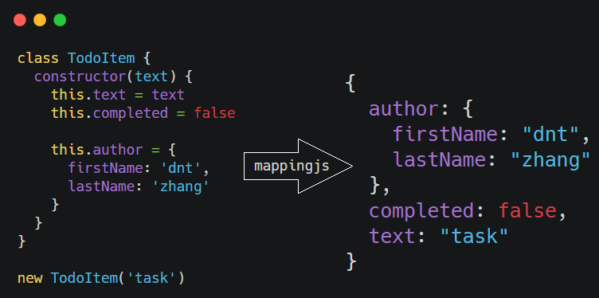

<p align="center"></p>

## Mappingjs

> Tiny size objects mapping lib for javascript. [Omi MVVM](https://github.com/Tencent/omi/blob/master/tutorial/omi-mvvm.md)'s best partner.

## Install

```js
npm i mappingjs
```

## Usage

```js
class TodoItem {
  constructor(text, completed) {
    this.text = text
    this.completed = completed || false

    this.author = {
      firstName: 'dnt',
      lastName: 'zhang'
    }
  }
}

const from = new TodoItem('task')
const to = { author: { age: 18 } }

mapping(from, to, {
  fullName: function () {
    return this.author.firstName + this.author.lastName
  }
})
```

So the value of `to` is:

```js
{
  author: {
    firstName: "dnt",
    lastName: "zhang",
    age: 18
  },
  fullName: 'dntzhang',
  completed: false,
  text: "task"
}
```


[→ Here's a more complex example](https://github.com/Tencent/omi/blob/master/packages/mappingjs/test/test.js#L250-L276)


## License

MIT © [dntzhang](https://github.com/dntzhang)