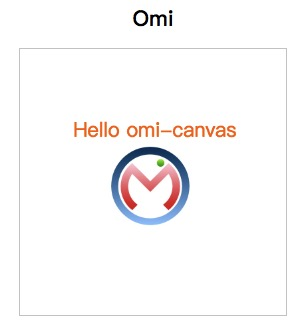

# omi-canvas

> Perfect fusion of web components, jsx and canvas.

The current version is v0.0.0. v1.0.0 is coming soon.

[→ Online DEMO](https://tencent.github.io/omi/packages/omi-canvas/examples/simple/)

```js
import { render, define, WeElement } from 'omi'
import 'omi-canvas'
import omiUrl from './omi.jpg'

define('my-app', class extends WeElement {

  css() {
    return `
        div{
          text-align: center;
        }`
  }

  onClick = (evt)=> {
    alert('Hello omi-canvas')
  }

  render() {
    return (
      <div>
        <h1>Omi</h1>
        <omi-canvas 
          width={400} 
          height={400}
         css='border: 1px solid #ccc;'>
          <text
            text='Hello omi-canvas'
            font='30px Segoe UI'
            color='#ff7700'
            baseline='top'
            x={80}
            y={100}
          />
          <bitmap
            onClick={this.onClick}
            src={omiUrl}
            cursor='pointer'
            scale={0.5}
            x={130}
            y={140}
          />
        </omi-canvas>
      </div>
    )
  }
})

render(<my-app />, 'body')
```

The effect shown below:



## Property

### Transform

|name      |Describe   |
|---|---|
| x | Horizontal offset |
| y | Vertical offset |
| scaleX | Horizontal scaling |
| scaleY | Vertical scaling |
| scale | Horizontal and Vertical scaling |
| rotation | rotation |
| skewX | skewX |
| skewY | skewY |
| originX |Rotation base point X |
| originY | Rotation base point Y |

### Alpha

|Name      |Describe   |
|---|---|
| alpha | The transparency of the element |

Notice that the father and son have set up alpha to do multiplicative stacking.

### compositeOperation 

|Name      |Describe   |
|---|---|
| compositeOperation | The superposition pattern drawn from the source image to the target image |

Notice that if you don't have a definition of compositeOperation to look up, find the nearest compositeOperation's parent container as its own compositeOperation.

### Cursor

|Name      |Describe   |
|---|---|
| cursor | The shape of the mouse |

### Fixed

|Name      |Describe   |
|---|---|
| fixed | Whether to fixed or not, the default is false, and set to true will not overlay the transform of ancestors. |

### Shadow

|Name      |Describe   |
|---|---|
| shadow | shadow|

Usage:

```js
<text
  text='omi'
  shadow = {
    color: '#42B035',
    offsetX: -5,
    offsetY: 5,
    blur: 10
    } 
/>
```

## Events Supported in omi-canvas

|**Supported List**|
|----------|
|onClick|
|onTouchStart|
|onTouchMove|
|onTouchEnd|
|onTouchCancel|
|onMouseMove|
|onMouseDown|
|onMouseUp|
|onMouseOver|
|onMouseOut|
|onDblClick|
|onContextMenu|
|onDrag|

## License

MIT © [dntzhang](https://github.com/dntzhang/)
