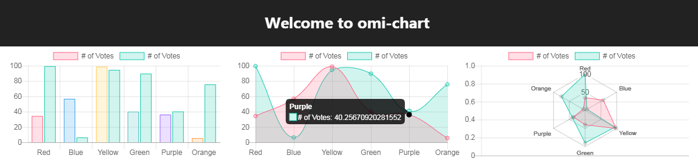

<p align="right">v<strong>1.0.0</strong></p>
<p align="center"></p>
<h2 align="center">omi-chart</h2>
<p  align="center">Simple HTML5 Charts using <strong>chart-x</strong> tag powered by <a href="https://github.com/Tencent/omi">omi</a> and <a href="https://www.chartjs.org/" rel="nofollow">chart.js</a>.</p>

---

[](https://tencent.github.io/omi/packages/omi-chart/repl/index.html)

- Bar charts
  - [Simple](https://tencent.github.io/omi/packages/omi-chart/repl/index.html)
  - [Vertical](https://tencent.github.io/omi/packages/omi-chart/repl/bar-vertical.html)
  - [Horizontal](https://tencent.github.io/omi/packages/omi-chart/repl/bar-horizontal.html)
  - [Multi Axis](https://tencent.github.io/omi/packages/omi-chart/repl/bar-multi-axis.html)
  - [Stacked Group](https://tencent.github.io/omi/packages/omi-chart/repl/bar-stacked-group.html)
- Line charts
  - [Base](https://tencent.github.io/omi/packages/omi-chart/repl/line-base.html)
  - [Multi Axis](https://tencent.github.io/omi/packages/omi-chart/repl/line-multi-axis.html)
  - [Stepped](https://tencent.github.io/omi/packages/omi-chart/repl/line-stepped.html)
  - [Fill](https://tencent.github.io/omi/packages/omi-chart/repl/line-fill.html)
  - [Interpolation Modes](https://tencent.github.io/omi/packages/omi-chart/repl/line-interpolation-modes.html)
  - [Point Sizes](https://tencent.github.io/omi/packages/omi-chart/repl/line-point-sizes.html)
  - [Styles](https://tencent.github.io/omi/packages/omi-chart/repl/line-styles.html)    
  - [Point Styles](https://tencent.github.io/omi/packages/omi-chart/repl/line-point-styles.html)    
- Scatter charts
  - [Base](https://tencent.github.io/omi/packages/omi-chart/repl/scatter-base.html)
  - [Multi Axis](https://tencent.github.io/omi/packages/omi-chart/repl/radar-multi-axis.html)
- Other charts
  - [Pie](https://tencent.github.io/omi/packages/omi-chart/repl/pie.html)
  - [Doughnut](https://tencent.github.io/omi/packages/omi-chart/repl/doughnut.html)
  - [Radar](https://tencent.github.io/omi/packages/omi-chart/repl/radar.html)
  - [PolarArea](https://tencent.github.io/omi/packages/omi-chart/repl/polar-area.html)
  - [Bar Line](https://tencent.github.io/omi/packages/omi-chart/repl/bar-line.html)

## Principle

```js
import { WeElement, define } from 'omi'
import Chart from 'chart.js'

class ChartBase extends WeElement {
  receiveProps(props) {
    this.chart.data = props.data
    this.chart.options = props.options
    this.chart.update()
  }

  render(props) {
    return (
      <div style={{ width: props.width + 'px', height: props.height + 'px' }}>
        <canvas ref={(e) => { this.canvas = e }}>
        </canvas>
      </div>
    )
  }
}

define('chart-bar', class extends ChartBase {
  installed() {
    this.chart = new Chart(this.canvas.getContext('2d'), {
      type: this.props.horizontal ? 'horizontalBar' : 'bar',
      data: this.props.data,
      options: this.props.options
    })
  }
})


define('chart-line', class extends ChartBase {
  installed() {
    this.chart = new Chart(this.canvas.getContext('2d'), {
      type: 'line',
      data: this.props.data,
      options: this.props.options
    })
  }
})


define('chart-scatter', class extends ChartBase {
  installed() {
    this.chart = new Chart.Scatter(this.canvas.getContext('2d'), {
      data: this.props.data,
      options: this.props.options
    })
  }
})
```

## License

MIT
