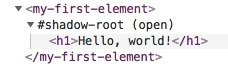

[English](./main-concepts.md) | 简体中文

## Omi 文档

- [My First Element](#my-first-element)
- [Props](#props)
- [Event](#event)
- [Custom Event](#custom-event)
- [Ref](#ref)
- [Store](#store)

### My First Element

```js
import { WeElement, tag, render } from 'omi'

@tag('my-first-element')
class MyFirstElement extends WeElement {
    render() {
        return (
            <h1>Hello, world!</h1>
        )
    }
}

render(<my-first-element></my-first-element>, 'body')
```

在 HTML 开发者工具里看看渲染得到的结构:



除了渲染到 body，你可以在其他任意自定义元素中使用 `my-first-element`。


### Props

```js
import { WeElement, tag, render } from 'omi'

@tag('my-first-element')
class MyFirstElement extends WeElement {
    render(props) {
        return (
            <h1>Hello, {props.name}!</h1>
        )
    }
}

render(<my-first-element name="world"></my-first-element>, 'body')
```

你也可以传任意类型的数据给 props:

```js
import { WeElement, tag, render } from 'omi'

@tag('my-first-element')
class MyFirstElement extends WeElement {
    render(props) {
        return (
            <h1>Hello, {props.myObj.name}!</h1>
        )
    }
}

render(<my-first-element my-obj={{ name: 'world' }}></my-first-element>, 'body')
```

`my-obj` 将映射到 myObj，驼峰的方式。


### Event

```js
class MyFirstElement extends WeElement {
    onClick = (evt) => {
        alert('Hello Omi!')
    }

    render() {
        return (
            <h1 onClick={this.onClick}>Hello, wrold!</h1>
        )
    }
}
```

### Custom Event

```js
@tag('my-first-element')
class MyFirstElement extends WeElement {
    onClick = (evt) => {
        this.fire('myevent', { name: 'abc' })
    }

    render(props) {
        return (
            <h1 onClick={this.onClick}>Hello, world!</h1>
        )
    }
}

render(<my-first-element onMyEvent={(evt) => { alert(evt.detail.name) }}></my-first-element>, 'body')
```

通过 `this.fire` 触发自定义事件，fire 第一个参数是事件名称，第二个参数是传递的数据。通过 `evt.detail` 可以获取到传递的数据。

### Ref

```js
@tag('my-first-element')
class MyFirstElement extends WeElement {
    onClick = (evt) => {
        console.log(this.h1)
    }

    render(props) {
        return (
            <div>
                <h1 ref={e => { this.h1 = e }} onClick={this.onClick}>Hello, world!</h1>
            </div>
        )
    }
}

render(<my-first-element></my-first-element>, 'body')
```


在元素上添加 `ref={e => { this.anyNameYouWant = e }}` ，然后你就可以 JS 代码里使用 `this.anyNameYouWant` 访问该元素。


### Store

```js
import { WeElement, tag, render } from 'omi'

@tag('my-first-element')
class MyFirstElement extends WeElement {
    //You must declare data here for view updating
    static get data() {
        return { name: null }
    }
    
    onClick = () => {
        //auto update the view
        this.store.data.name = 'abc'
    }

    render(props, data) {
        //data === this.store.data when using store stystem
        return (
            <h1 onClick={this.onClick}>Hello, {data.name}!</h1>
        )
    }
}

const store = {
    data: { name: 'Omi' }
}
render(<my-first-element name="world"></my-first-element>, 'body', store)
```

当使用 store 体系是，`static get data` 就仅仅被用来声明依赖，举个例子:

```js
static get data() {
    return {
        a: null,
        b: null,
        c: { d: [] },
        e: []
    }
}

```

会被转换成：

```js
{
  a: true,
  b: true,
  'c.d':true,
  e: true
}
```

举例说明 Path 命中规则:

| Proxy Path | updatePath  |是否更新|
| ------ | ------  |------  |
| abc | 	abc  |	更新 |	 
| abc[1] | 	abc  |	更新 |
| abc.a| 	abc  |	更新 |
| abc| 	abc.a  |	不更新 |
| abc| 	abc[1]  |	不更新 |
| abc| 	abc[1].c  |	不更新 |
| abc.b| 	abc.b |	更新 |

以上只要命中一个条件就可以进行更新！

总结就是只要等于 updatePath 或者在 updatePath 子节点下都进行更新！

看可以看到 store 体系是中心化的体系？那么怎么做到部分组件去中心化？使用 tag 的第二个参数:

```js
@tag('my-first-element', true)
```

纯元素！不会注入 store!
