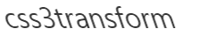

# omi-transform

  Made css3 transform super easy.



Supported properties(get and set): 

| **Property**    | **Describe**                           |
| --------- | ---------------------- |
| translateX |translateX |
| translateY |translateY |
| translateZ |translateZ |
| scaleX |scaleX |
| scaleY |scaleY |
| scaleZ |scaleZ|
| rotateX |rotateX |
| rotateY |rotateY |
| rotateZ |rotateZ |
| skewX | skewX|
| skewY |skewY |
| originX |  the basic x point of rotation|
| originY | the basic y point of rotation |
| originZ |  the basic z point of rotation|
| perspective |Perspective projection distance |


## Usage

```js
import { render, WeElement, tag } from "omi";
import "omi-transform";

@tag("my-app")
class MyApp extends WeElement {
  install() {
    this.data.rotateZ = 30
    this.linkRef = (e) => {
      this.animDiv = e
    }
  }

  installed() {
    setInterval(() => {
      //slow
      // this.data.rotateZ += 2
      // this.update()

      //fast
      this.animDiv.rotateZ += 2
      //sync for update call of any scenario
      this.data.rotateZ = this.animDiv.rotateZ
    }, 16)


  }
  render(props, data) {
    return (
      <css3-transform rotateZ={data.rotateZ} translateX={0} perspective={0} >
        <div ref={this.linkRef}>
          omi-transform
          </div>
      </css3-transform>
    )
  }
}

render(<my-app />, "body");
```

## Using in pure js


```js
var ele = document.querySelector("#test1")
Transform(element1)
element1.rotateZ = 45
```

### Demos

* [homepage](https://tencent.github.io/omi/packages/omi-transform/css3transform/)
* [all](https://tencent.github.io/omi/packages/omi-transform/css3transform/examples/all.html)
* [soft](https://tencent.github.io/omi/packages/omi-transform/css3transform/examples/soft.html)
* [3d](https://tencent.github.io/omi/packages/omi-transform/css3transform/examples/stars.html)

## License

MIT © dntzhang
