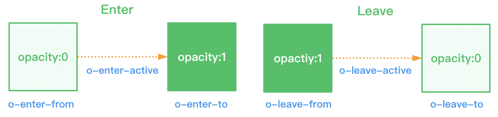

## omi-transition

Define transition animation for entering and leaving.



- fade-enter-from: defines the start state of entering the transition
- fade-enter-active: defines the state when the transition takes effect and is removed after the transition animation is completed
- fade-enter-to: define the end state of entering the transition, and remove it after the transition animation is completed
- fade-leave-from: define the start state of leaving the transition
- fade-leave-active: defines the state when leaving the transition takes effect
- fade-leave-to: define the end state of leaving the transition, and remove it after the transition animation is completed

## Install

```js
import 'omi-transition'
```


## Usage

```tsx
import { render, signal, tag, Component, h } from 'omi'
import 'omi-transition'

const show = signal(false)

@tag('transition-demo')
class TransitionDemo extends Component {
  static css = `
    .fade-leave-to,
    .fade-enter-from {
      opacity: 0;
      transform: translateX(15px);
    }

    .fade-leave-active,
    .fade-enter-active {
      transition: all 500ms ease-in;
    }`

  render() {
    return (
      <>
        <button onClick={() => show.value = !show.value}>toggle</button>
        <h4 show={show.value} o-transition={{ name: "fade" }} >OMI</h4>
      </>
    )
  }
}

render(<transition-demo />, document.body)
```

## API

### Options

```tsx
type DomType = HTMLElement | Component;

interface TransitionOptions {
  name: string;
  delay?: number;
  beforeEnter?: (dom: DomType) => void;
  enter?: (dom: DomType)  => void;
  afterEnter?: (dom: DomType) => void;
  beforeLeave?: (dom: DomType) => void;
  leave?: (dom: DomType) => void;
  afterLeave?: (dom: DomType) => void;
}
```
