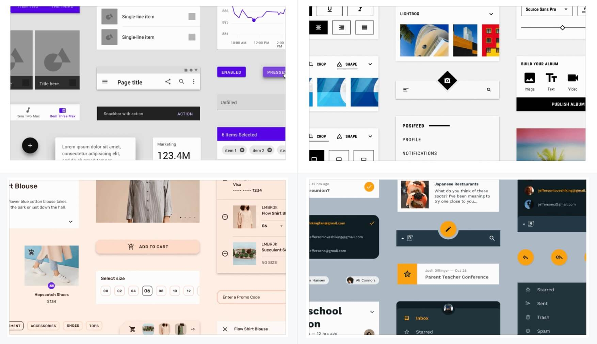

# Omim

Cross-Frameworks components, powered by Material Design and [Omi](https://github.com/Tencent/omi).

* [DOCS & REPL](https://tencent.github.io/omi/packages/omim/docs/build/index.html)
* [material.io docs](https://material.io/develop/web/components/buttons/) & [material.io demo](https://material-components.github.io/material-components-web-catalog/#/) 



## Features

* Simple wrapper of [material-components-web](https://github.com/material-components/material-components-web)
* Render by Custom Elements of Web Components
* Any framework can use the components, such as Omi, React, Vue and Angular 
* Support both JSX and native HTML elements 
* Each element can be used independently

## Usage

### Via script

```html
<m-button>I am button</m-button>

<script src="https://unpkg.com/omi"></script>
<script src="https://unpkg.com/@omim/core@latest/button/index.js"></script>
```

### Via npm

``` bash
npm install @omim/core
```

Then:

```js
import '@omim/core/button'
```

Then use the element in Omi, React, Vue or Angular:

``` html
<m-button>I am button</m-button>
```

It can also be used in pure js:

```js
var button = document.createElement('m-button')
button.innerHTML = 'I am button'
document.body.append(button)
button.addEventListener('click', function () {
  console.log('Clicked!')
})

//or
//document.body.innerHTML = '<m-button>I am button</m-button>'
```

## Change Theme Color

```js
window.OmimThemePrimary =  'red'
window.OmimThemeSecondary =  'blue'
window.OmimThemeError =  'yellow'

import '@omim/core/button'
```

or

```html
<m-button>I am button</m-button>

<script src="https://unpkg.com/omi"></script>
<script>
  window.OmimThemePrimary =  'red'
  window.OmimThemeSecondary =  'blue'
  window.OmimThemeError =  'yellow'
</script>
<script src="https://unpkg.com/@omim/core@latest/button/index.js"></script>
```

## Contribution

### CMD

Build component:

```bash
npm run build -- component-name
```

Build demo:

```bash
npm start demo-name
```

Publish:

```bash
npm publish --access public
```

To prevent duplication of development, PR submission fills in owner to lock the component.

为了防止重复开发，先 PR 提交填下 owner 锁定该组件。

| **Components**                         | **Owner**                    |
| ------------------------------- | ----------------------------------- |
| button | done |
| icon | done |
| text-field | done |
| card | wscats |
| chip | hulei |
| dialog | zainchen |
| elevation | liulinboyi |
| image-list| done |
| checkbox| done |
| radio| lihengjun |
| select| done |
| slider| done |
| switch| zainchen |
| layout-grid| done |
| linear-progress| done |
| list| zainchen |
| menu| done|
| snackbar| done |
| tab | FAKER-A |
| tag | mtonhuang |
| top-app-bar| zainchen |
| typography| done |
| drawer | zainchen |
| badge | done |
| fab | done |
| icon-button | done |
| toolbar | hulei |
| welcome to add a new element! |  |
| welcome to add a new element! |  |

Some [material packages](https://github.com/material-components/material-components-web/tree/master/packages) have not yet been released. Please wait for their release. Or pull the corresponding package from the branch to implement, without starting from scratch.

有些 [material packages](https://github.com/material-components/material-components-web/tree/master/packages) 尚未发布，请等待其发布后 omi 再去实现。或者从分支中拉去对应的 package 进行实现，不必从零开始实现。

## Todo

### TypeScript Auto Complete(todo)

```jsx
interface ButtonProps {
  href?: string,
  disabled?: boolean,
  type?: 'default' | 'primary' | 'danger',
  onClick?: (e: any) => void
}

const TAG = 'm-button'

declare global {
  namespace JSX {
    interface IntrinsicElements {
      [TAG]: Omi.Props & ButtonProps
    }
  }
}

@tag(TAG)
export default class Button extends WeElement<ButtonProps, {}> {
...
...
...
```

### Import core(todo)

Support import all element of core:

```
import '@import/core'
```

### Omim Page Templates(todo)

[Coming!](https://github.com/Tencent/omi/tree/master/packages/omim/templates)