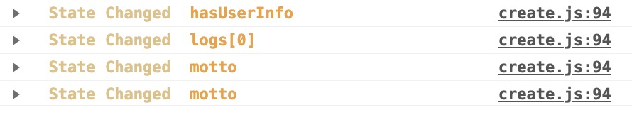

## omix

> 小程序全局状态管理，极小却精巧，对小程序零入侵，能驾驭小项目、中项目和大型项目

TypeScript 版本的例子可以点击这里 [omix-ts](https://github.com/Tencent/omi/tree/master/packages/omix-ts)

## 3分钟精通 

### API

* `create(store, option)`     创建页面， store 可跨页面共享
* `create(option)`            创建组件
* `this.store.data` 或 `this.data`   全局 store 和 data，页面和页面所有组件可以拿到， 操作 data 会自动更新视图

## 实战

定义 store:

```js
export default {
  data: {
    logs: []
  }
}
```

定义页面:

```js
import create from '../../utils/create'
import util from '../../utils/util'
import store from '../../store'

create(store, {
  //声明依赖
  use: ['logs'], //也支持复杂的格式，比如 ['list[0].name']

  onLoad: function () {
    this.store.data.logs = (wx.getStorageSync('logs') || []).map(log => {
      return util.formatTime(new Date(log))
    })

    setTimeout(() => {
      this.data.logs[0] = 'Changed!'
    }, 1000)

    setTimeout(() => {
      this.store.data.logs.push(Math.random(), Math.random())
    }, 2000)

    setTimeout(() => {
      this.data.logs.splice(this.store.data.logs.length - 1, 1)
    }, 3000)
  }
})
```

```html
<view class="container log-list">
  <block wx:for="{{logs}}" wx:for-item="log">
    <text class="log-item">{{index + 1}}. {{log}}</text>
  </block>
  <view>
    <test-store></test-store>
  </view>
</view>
```

可以看到里面使用 test-store 组件, 组件内也可以组件使用全局的 logs，组件源码:

```js
import create from '../../utils/create'

create({
  
})
```

```html
<view class="ctn">
  <view>
    <text>Log Length: {{logs.length}}</text>
  </view>
</view>
```


## 其他配置

修改 store.js 的 debug 字段用来打开和关闭 log 调试:

```js
export default {
  data: {
    motto: 'Hello World',
    userInfo: {},
    hasUserInfo: false,
    canIUse: wx.canIUse('button.open-type.getUserInfo'),
    logs: []
  },
  debug: true, //我是开关
  updateAll: true //当为 true 时，无脑全部更新，组件或页面不需要声明 use
}
```

默认是打开的，`store.data` 的所以变动都会出现在开发者工具 log 面板，如下图所示:



## 其他

这里需要注意，改变数组的 length 不会触发视图更新，需要使用 size 方法:

```js
this.oData.arr.size(2) //会触发视图更新
this.oData.arr.length = 2 //不会触发视图更新

this.oData.arr.push(111) //会触发视图更新
//每个数组的方法都有对应的 pureXXX 方法
this.oData.arr.purePush(111) //不会触发视图更新
```

###  函数属性

```js
  use: [
    'motto',
    'userInfo',
    'hasUserInfo',
    'canIUse',
    {
      reverseMotto:[
        ['motto'],
        motto => motto.split('').reverse().join('')
      ]
    }
  ],
```

函数属性定义在页面或者组件的 use 里，如上面的 `reverseMotto`， 它可以直接绑定在 wxml 里，motto 更新会自动更新 reverseMotto 的值。

### store 变化监听

```js
const handler = function (evt) {
  console.log(evt)
}
//监听，允许绑定多个
store.onChange(handler)
//移除监听
store.offChange(handler) 
```

### 复杂 store 拆分到多文件

当小程序变得非常复杂的时候，单文件单一的 store 会变得非常臃肿，所以需要拆分为多个 store 到新的文件，这里举个例子：

store-a.js:

```js
export const data = {
  name: 'omix'
}

export function changeName(){
  data.name = 'Omix'
}
```

store-b.js:

```js
export const data = {
  name: 'dntzhang',
  age: 18
}

export function changeAge(){
  data.age++
}
```

store.js 合并所以子 store 到对应模块(a, b):

```js
import { data as dataA, changeName } from 'store-a.js'
import { data as dataB, changeAge } from 'store-b.js'

const store = {
  data:{
    a: dataA,
    b: dataB
  },
  a: { changeName },
  b: { changeAge }
}

export default store
```

数据绑定:

```html
<view>
  <text>{{a.name}}</text>
  <text>{{b.name}}-{{b.age}}</text>
</view>
```

数据使用:

```js
import create from '../../utils/create'
import store from '../../store/store'

create(store, {
  //声明依赖
  use: ['a.name', 'b'],
  onLoad: function () {
    setTimeout(_ => {
      store.a.changeName()
    }, 1000)

    setTimeout(_ => {
      store.b.changeAge()
    }, 2000)
  }
})
```

完整的案例可以 [点击这里](https://github.com/Tencent/omi/tree/master/packages/omix-multi-store)

## Q & A

* 比如我一个弹窗组件，可能在很多页面使用，也可能在同一个页面使用多次；如果使用store来作为组件间通信的话，怎么应用可以实现组件是纯组件而不跟业务相关呢?

纯组件不用不用 create 创建，且该组件内使用 [triggerEvent](https://developers.weixin.qq.com/miniprogram/dev/framework/custom-component/events.html) 通知父组件改变 store.data 或者调用 store 的方法与外界通讯。

## License

MIT © Tencent
