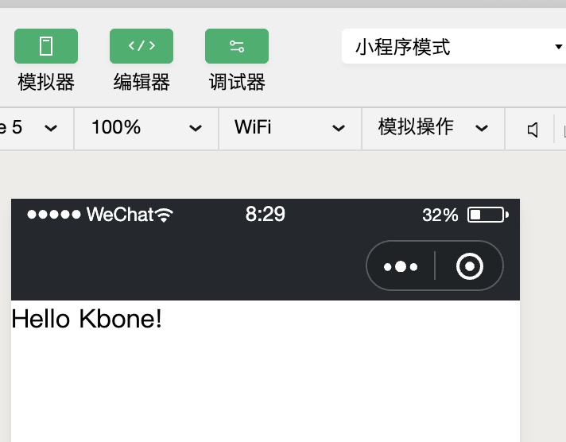
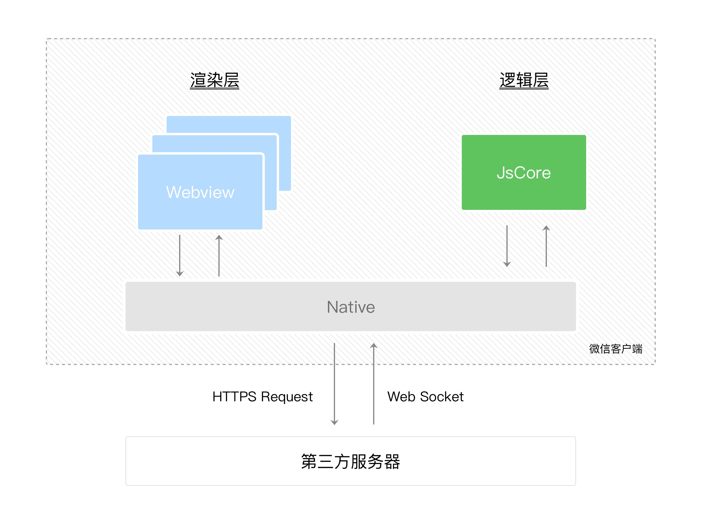
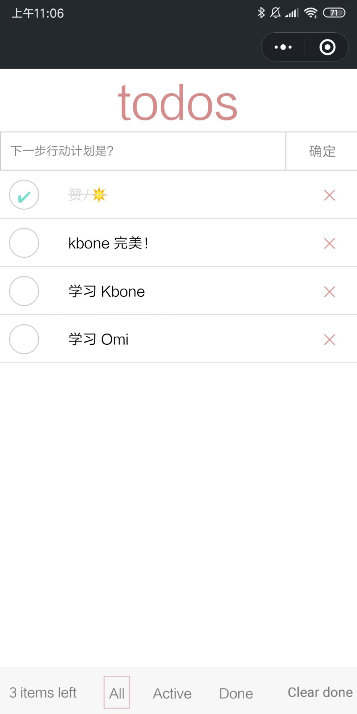
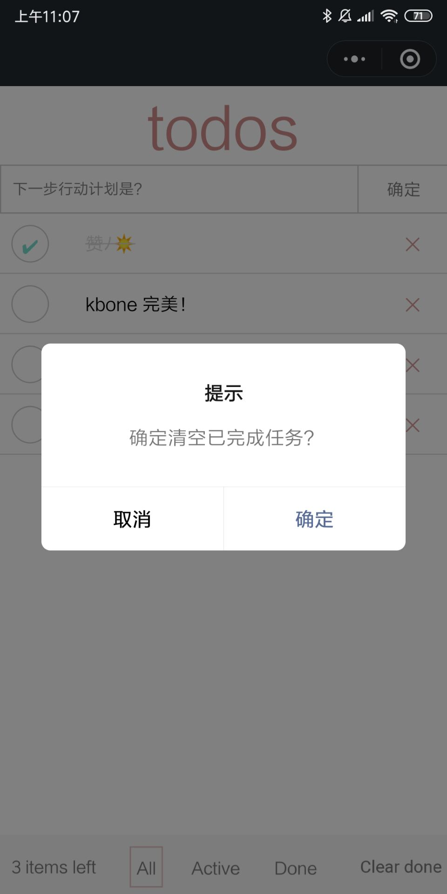
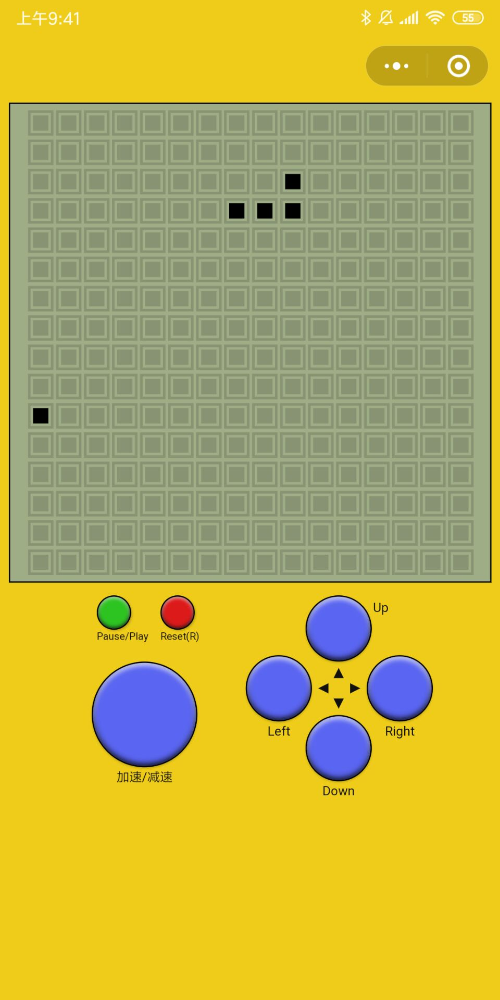
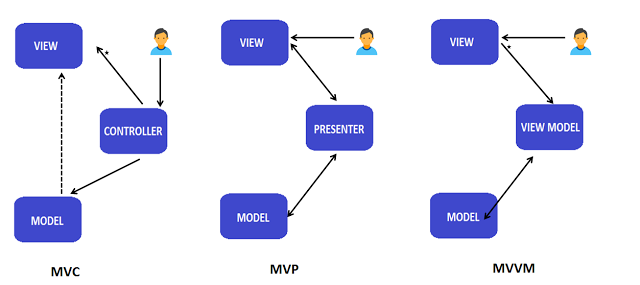

## 多端统一框架 kbone - 支持 Omi、React、Vue 和原生JS

kbone 是小程序官方出的多端统一框架，市面上就很多跨端开发框架，但是 kbone 是最彻底的一款。因为:

> kbone 不仅可以开发小程序和 Web，而且可以使用**任意前端框架**开发小程序和 Web。

* [omi-kbone](https://github.com/Tencent/omi/tree/master/packages/omi-kbone)
* [vue-kbone](https://github.com/wechat-miniprogram/kbone)
* [react-kbone](https://github.com/Tencent/omi/tree/master/packages/react-kbone)
* [preact-kbone](https://github.com/Tencent/omi/tree/master/packages/preact-kbone)

阅读本文你可以收获：

* Kbone 基础原理
* 使用 omis + kbone 开发小程序 TodoApp
* 使用 vue + kbone 开发小程序 Counter
* 使用 react + kbone 开发小程序 Counter(Hook)
* 使用 preact + kbone 开发小程序 Counter(Class Component)
* 使用 omis + kbone 开发小程序游戏贪吃蛇
* 使用 kbone 开发多页应用
* 领域驱动设计在前端的集成
* 理解 MVC、MVP、MVVM 模式
* 使用 DOM 编写小程序游戏（并非小游戏）
* 游戏主帧率和局部帧率控制

## Kbone 基础原理

打开 Kbone 官方编译出的小程序的 index.js，修改其中的代码：

```js
const mp = require('miniprogram-render')
const config = require('../../config')

function init(window, document) {
    require('../../common/vendors~index.js')(window, document);

    const ele = document.createElement('div')
    ele.innerHTML = 'Hello Kbone!'
    document.body.appendChild(ele)
}
...
```

运行效果如下:




上面的代码运行在小程序里。可以窥见其一二：

* Kbone 实现了完整的 DOM/BOM 对象模型，即官方的 miniprogram-render
* Kbone 允许 react、omi 和 vue 的完整 runtime 嵌入在小程序中

还有看不见的，比如：

* Kbone 利用自定义组件渲染所有 DOM 节点
* 自定义组件可以自引用来描述完整 DOM 树

该自定义组件就是官方封装的 miniprogram-element：

```json
{
  "usingComponents": {
    "element": "miniprogram-element"
  }
}
```

```html
<element data-private-node-id="{{nodeId}}" data-private-page-id="{{pageId}}"></element>
````

pageId 和 nodeId 两个参数缺一不可，组件内部会根据传入的 pageId 找到对应的 window/document，然后根据 nodeId 找到对应的 dom 节点进行渲染。
上面说了，miniprogram-render 实现了轻量的 DOM 对象模型，所以不管是框架还是原生js执行之后，输出一些节点信息，也算是虚拟 DOM，比如嵌套的 childNodes。miniprogram-element 可以根据节点信息作为自定义组件的 data，并且遍历生产 WXML 组件的节点树。


其中 v-dom 相当于数据(这里可能有点绕，dom 作为 dom 渲染的数据，但事实就是如此)， mp-element 相当于模板，数据+模板完成渲染。其中前面三个步骤都是运行在小程序逻辑层(JSCore)当中，使用逻辑层自己模拟出来的 DOM/BOM API，也就是官方的 miniprogram-render。



问：jsx 怎么生成 wxml 的？

再绕一次：因为 react 或者 omi 里的 jsx 会生成 v-dom，在浏览器里最后都会映射到 dom api 生成 dom 树和设置属性，然后在小程序当中，jsx 生成 v-dom 然后映射到自己模拟的 dom api，所以可以生成另外一份 v-dom（浏览器中是真实 dom），作为自定义 element 的数据进行 wxml 渲染。

## 实战 TodoApp

|                   |                       |
| ------------------------------- | ----------------------------------- |
|  |  |


### 快速开始

```js
npm i omi-cli -g
omi init-kbone my-app
cd my-app
npm start        //开发小程序
npm run web      //开发 web
npm run build    //发布 web
```

> 也支持一条命令 `npx omi-cli init-kbone my-app` (npm v5.2.0+)


## 目录说明

```
├─ build
│  ├─ mp     //微信开发者工具指向的目录，用于生产环境
│  ├─ web    //web 编译出的文件，用于生产环境
├─ config
├─ public
├─ scripts
├─ src
│  ├─ assets
│  ├─ components    //存放所有组件
│  ├─ log.js        //入口文件，会 build 成  log.html
│  └─ index.js      //入口文件，会 build 成  index.html
```

定义结构：

```jsx
const Todo = (props, { clear, filter, textInput, inputText, todo, left, type, newTodo, done, toggle, deleteItem }) => {
  return (
    <div class="container">
      <div class="title">todos</div>
      <div class="form">
        <input class="new-todo" onInput={textInput} value={inputText} placeholder="下一步行动计划是？" autofocus=""></input>
        <button class="add-btn" onClick={newTodo}>确定</button>
      </div>

      <div class="todo-list">
        {todo.map(item => (
          (type === 'all' || (type === 'active' && !item.done) || (type === 'done' && item.done)) && <div class={`todo-item${item.done ? ' done' : ''}`}>
            <div class="toggle" data-id={item.id} onClick={toggle}></div>
            <text >{item.text} </text>
            <div class="delete" data-id={item.id} onClick={deleteItem}></div>
          </div>
        ))}
      </div>

      <TodoFooter onFilter={filter} onClear={clear} left={left} done={done} type={type} ></TodoFooter>
    </div>
  )
}
```

定义 store:

```jsx

Todo.store = _ => {
  return {

    todo: [{ text: '学习 Kbone', id: 0 }, { text: '学习 Omi', id: 1 }],
    id: 1,
    inputText: '',
    left: 2,
    type: 'all',
    done: 0,

    textInput(evt) {
      this.inputText = evt.target.value
    },

    toggle(evt) {
      for (let i = 0, len = this.todo.length; i < len; i++) {
        const item = this.todo[i]
        if (item.id === Number(evt.target.dataset.id)) {
          item.done = !item.done
          this.computeCount()
          _.update()
          break
        }
      }
    },

    computeCount() {
      this.left = 0
      this.done = 0
      for (let i = 0, len = this.todo.length; i < len; i++) {
        this.todo[i].done ? this.done++ : this.left++
      }
    },

    deleteItem(evt) {
      for (let i = 0, len = this.todo.length; i < len; i++) {
        const item = this.todo[i]
        if (item.id === Number(evt.target.dataset.id)) {
          this.todo.splice(i, 1)
          this.computeCount()
          _.update()
          break
        }
      }
    },

    newTodo() {
      if (this.inputText.trim() === '') {
        wx.showToast({
          title: '内容不能为空',
          icon: 'none',
          duration: 2000
        })

        return
      }

      this.todo.unshift({
        text: this.inputText,
        id: ++this.id,
        done: false,
        createTime: new Date()
      })
      this.computeCount()
      this.inputText = ''
      _.update()

    },

    filter(type) {
      //因为是自定义事件
      //注意这里的 this 指向，不能直接 this.type = type
      _.store.type = type
      _.update()
    },

    clear(evt) {
      //因为是自定义事件
      //注意这里的 this 指向
      const self = _.store
      wx.showModal({
        title: '提示',
        content: '确定清空已完成任务？',
        success: (res) => {
          if (res.confirm) {
            for (let i = 0, len = self.todo.length; i < len; i++) {
              const item = self.todo[i]
              if (item.done) {
                self.todo.splice(i, 1)
                len--
                i--
              }
            }
            self.done = 0
            _.update()

          } else if (res.cancel) {
            console.log('用户点击取消')
          }
        }
      })

    }

  }
}

```

抽取 todo-footer 组件：

```jsx
import { h } from 'omis'
import './index.css'

const TodoFooter = ({ left, type, done }, { showAll, showActive, showDone, clearDone }) => {
  return <div class="footer">
    <div class="todo-count"><text class="strong">{left + ' '}items left</text> </div>
    <div class="filters">
      <div class='ib' onClick={showAll}>
        <text class={type === 'all' ? 'selected' : ''} >All</text>
      </div>
      <div class='ib' onClick={showActive}>
        <text class={type === 'active' ? 'selected' : ''} >Active</text>
      </div>
      <div class='ib' onClick={showDone}>
        <text class={type === 'done' ? 'selected' : ''} >Done</text>
      </div>
    </div>
    {done > 0 && <button class="clear-completed" onClick={clearDone}>Clear done</button>}
  </div>
}

TodoFooter.store = ({props})=> {
  return {
    showAll() {
      props.onFilter('all')
    },

    showActive() {
      props.onFilter('active')
    },

    showDone() {
      props.onFilter('done')
    },

    clearDone() {
      props.onClear()
    }
  }
}

export default TodoFooter
```

上面完全使用 omis 开发，由于不喜欢react hook的设计，但又喜欢带状态或者不带状态的函数式组件，所有才有了 omis。omis 的好处一大堆：

> Functional Component + Store + Scoped Style + Web Components in tiny size

* 函数式风格但非函数式编程 
* 结构-样式-行为分离
* 支持 web components
* hyperscript 视觉上更加友好
* 每个组件可以带有一个 store，去中心化
* 支持全局 store 共享数据，并且按需局部更新组件，中心化
* 每个组件 store 拥有 update 方法，执行该方法局部刷新组件

如果你对 omis 不熟悉，可以看 [→ omis 文档](https://tencent.github.io/omi/site/omis/cn.html)

[→ TodoApp 源码](https://github.com/Tencent/omi/tree/master/packages/omi-kbone)

下面使用 omis 开发一个复杂一点的游戏案例。

## 实战贪吃蛇



参考和使用了部分 [react-tetris](https://chvin.github.io/react-tetris/) 的样式。

### 领域模型设计

* 提取主要实体，比如（蛇、游戏）
* 从实体名词中总结出具体业务属性方法，
  * 蛇
    * 包含运动方向、body属性
    * 包含移动和转向方法
  * 游戏
    * 包含结束暂停状态、地图、分数、帧率、游戏主角、食物
    * 包含开始游戏、暂停游戏、结束游戏、生产食物、重置游戏等方法
* 建立实体属性方法之间的联系
  * 游戏主角唯一，即蛇
  * 蛇吃食物，游戏分数增加
  * 食物消失，游戏负责再次生产食物
  * 蛇撞墙或撞自身，游戏状态结束
* 核心循环设计
  * 判断是否有食物，没有就生产一个(低帧率)
  * 蛇与自身碰撞检测
  * 蛇与障碍物碰撞检测
  * 蛇与食物碰撞检测
  * 蛇移动

### 使用代码描述蛇实体

```js
class Snake {
  constructor() {
    this.body = [3, 1, 2, 1, 1, 1]
    this.dir = 'right'
  }

  move(eating) {
    const b = this.body
    if (!eating) {
      b.pop()
      b.pop()
    }

    switch (this.dir) {
      case 'up':
        b.unshift(b[0], b[1] - 1)
        break
      case 'right':
        b.unshift(b[0] + 1, b[1])
        break
      case 'down':
        b.unshift(b[0], b[1] + 1)
        break
      case 'left':
        b.unshift(b[0] - 1, b[1])
        break
    }
  }

  turnUp() {
    if (this.dir !== 'down')
      this.dir = 'up'
  }
  turnRight() {
    if (this.dir !== 'left')
      this.dir = 'right'
  }
  turnDown() {
    if (this.dir !== 'up')
      this.dir = 'down'
  }
  turnLeft() {
    if (this.dir !== 'right')
      this.dir = 'left'
  }
}
```

蛇的转向有个逻辑，就是不能反方向后退，比如正在向上移动，不能直接直接向下转向，所以在 `turnUp`,`turnRight`,`turnDown`,`turnLeft` 中都有对应的条件判断。

### 使用代码描述游戏实体

```js
import Snake from './snake'

class Game {
  constructor() {
    this.map = []
    this.size = 16
    this.loop = null
    this.interval = 500
    this.paused = false
    this._preDate = Date.now()
    this.init()
  }

  init() {

    this.snake = new Snake

    for (let i = 0; i < this.size; i++) {
      const row = []
      for (let j = 0; j < this.size; j++) {
        row.push(0)
      }
      this.map.push(row)
    }
  }

  tick() {

    this.makeFood()
    const eating = this.eat()
    this.snake.move(eating)
    this.mark()

  }

  mark() {
    const map = this.map
    for (let i = 0; i < this.size; i++) {
      for (let j = 0; j < this.size; j++) {
        map[i][j] = 0
      }
    }

    for (let k = 0, len = this.snake.body.length; k < len; k += 2) {
      this.snake.body[k + 1] %= this.size
      this.snake.body[k] %= this.size

      if (this.snake.body[k + 1] < 0) this.snake.body[k + 1] += this.size
      if (this.snake.body[k] < 0) this.snake.body[k] += this.size
      map[this.snake.body[k + 1]][this.snake.body[k]] = 1
    }
    if (this.food) {
      map[this.food[1]][this.food[0]] = 1
    }
  }

  start() {
    this.loop = setInterval(() => {
      if (Date.now() - this._preDate > this.interval) {
        this._preDate = Date.now()
        if (!this.paused) {
          this.tick()
        }
      }
    }, 16)
  }

  stop() {
    clearInterval(this.loop)
  }

  pause() {
    this.paused = true
  }

  play() {
    this.paused = false
  }

  reset() {
    this.paused = false
    this.interval = 500
    this.snake.body = [3, 1, 2, 1, 1, 1]
    this.food = null
    this.snake.dir = 'right'
  }

  toggleSpeed() {
    this.interval === 500 ? (this.interval = 150) : (this.interval = 500)
  }

  makeFood() {
    if (!this.food) {
      this.food = [this._rd(0, this.size - 1), this._rd(0, this.size - 1)]
      for (let k = 0, len = this.snake.body.length; k < len; k += 2) {
        if (this.snake.body[k + 1] === this.food[1]
          && this.snake.body[k] === this.food[0]) {
          this.food = null
          this.makeFood()
          break
        }

      }
    }
  }

  eat() {
    for (let k = 0, len = this.snake.body.length; k < len; k += 2) {
      if (this.snake.body[k + 1] === this.food[1]
        && this.snake.body[k] === this.food[0]) {
        this.food = null
        return true
      }
    }
  }

  _rd(from, to) {
    return from + Math.floor(Math.random() * (to + 1))
  }
}
```

可以看到上图使用了 16*16 的二维数组来存储蛇、食物、地图信息。蛇和食物占据的格子为 1，其余为 0。

```js
[
  [0, 0, 0, 0, 0, 0, 0, 0, 0, 0, 0, 0, 0, 0, 0, 0],
  [0, 0, 0, 0, 0, 0, 0, 0, 0, 0, 0, 0, 0, 0, 0, 0],
  [0, 0, 1, 1, 1, 0, 0, 0, 0, 0, 0, 0, 0, 0, 0, 0],
  [0, 0, 0, 0, 1, 1, 0, 0, 0, 0, 0, 0, 0, 0, 0, 0],
  [0, 0, 0, 0, 0, 0, 0, 0, 0, 0, 0, 0, 0, 0, 0, 0],
  [0, 0, 0, 0, 0, 0, 0, 0, 0, 0, 0, 0, 0, 0, 0, 0],
  [0, 0, 0, 0, 0, 0, 0, 0, 0, 0, 0, 0, 0, 0, 0, 0],
  [0, 0, 0, 0, 0, 0, 0, 0, 0, 0, 0, 0, 0, 0, 0, 0],
  [0, 0, 0, 0, 0, 0, 0, 1, 0, 0, 0, 0, 0, 0, 0, 0],
  [0, 0, 0, 0, 0, 0, 0, 0, 0, 0, 0, 0, 0, 0, 0, 0],
  [0, 0, 0, 0, 0, 0, 0, 0, 0, 0, 0, 0, 0, 0, 0, 0],
  [0, 0, 0, 0, 0, 0, 0, 0, 0, 0, 0, 0, 0, 0, 0, 0],
  [0, 0, 0, 0, 0, 0, 0, 0, 0, 0, 0, 0, 0, 0, 0, 0],
  [0, 0, 0, 0, 0, 0, 0, 0, 0, 0, 0, 0, 0, 0, 0, 0],
  [0, 0, 0, 0, 0, 0, 0, 0, 0, 0, 0, 0, 0, 0, 0, 0],
  [0, 0, 0, 0, 0, 0, 0, 0, 0, 0, 0, 0, 0, 0, 0, 0]
]
```

所以上面代表了一条长度为 5 的蛇和 1 个食物，你能在上图中找到吗？

### 游戏面板渲染

```jsx
import { h } from 'omis'
import './_index.css'

const Game = ({ }, { }, _, { data }) => {
  return <div class="game">
    {data.map.map(row=>{
      return  <p>
          {row.map(col=>{
            if(col){
              return <b class='s'></b>
            }
            return <b></b>
          })}
      </p>
    })}
  </div>
}

Game.use = ['map']

export default Game
```

带有 class 为 s 的格式是黑色的，比如食物、蛇的身体，其余的会灰色底色。`Game.use` 的作用后面细讲，`map` 代表依赖 store.data.map，map更新会自动更新视图。

### 定义 store 

```js
import Game from '../models/game'

const game = new Game
const { snake, map } = game

game.start()

export default {
  data: {
    map
  },
  turnUp() {
    snake.turnUp()
  },
  turnRight() {
    snake.turnRight()
  },
  turnDown() {
    snake.turnDown()
  },
  turnLeft() {
    snake.turnLeft()
  },
  pauseOrPlay() {
    if (game.paused) {
      game.play()
    } else {
      game.pause()
    }
  },
  reset() {
    game.reset()
  },
  toggleSpeed() {
    game.toggleSpeed()
  }
}
```

会发现， store 很薄，只负责中转 View 的 action，到 Model，以及隐藏式自动映射 Model 上的数据到 View。

### 帧率控制

怎么控制主帧率和局部帧率。一般情况下，我们认为 60 FPS 是流畅的，所以我们定时器间隔是有 16ms，核心循环里的计算量越小，就越接近 60 FPS：

```js
this.loop = setInterval(() => {
  //
}, 16)
```

但是有些计算没有必要 16 秒计算一次，这样会降低帧率，所以可以记录上一次执行的时间用来控制帧率:

```js
this.loop = setInterval(() => {
  //执行在这里是大约 60 FPS
  if (Date.now() - this._preDate > this.interval) {
    //执行在这里是大约  1000/this.interval FPS
    this._preDate = Date.now()
    //暂停判断
    if (!this.paused) {
      //核心循环逻辑
      this.tick()
    }
  }
}, 16)
```

由于小程序 JSCore 里不支持 `requestAnimationFrame`，所以这里使用 setInterval。当然也可以使用 [raf-interval](https://github.com/dntzhang/raf-interval) 循环执行 tick:

```js
this.loop = setRafInterval(() => {
  //执行在这里是大约 60 FPS
  if (Date.now() - this._preDate > this.interval) {
    //执行在这里是大约  1000/this.interval FPS
    this._preDate = Date.now()
    //暂停判断
    if (!this.paused) {
      //核心循环逻辑
      this.tick()
    }
  }
}, 16)
```

用法和 setInterval 一致，只是内部使用 setTimeout 且如果支持 `requestAnimationFrame` 会优先使用 `requestAnimationFrame`。

[→ 贪吃蛇源码](https://github.com/Tencent/omi/tree/master/packages/omi-kbone)


### 贪吃蛇目录说明

```
├─ build
│  ├─ mp     //微信开发者工具指向的目录，用于生产环境
│  ├─ web    //web 编译出的文件，用于生产环境
├─ config
├─ public
├─ scripts
├─ src
│  ├─ assets
│  ├─ components    //存放所有页面的组件
│  ├─ models        //存放所有模型
│  ├─ stores        //存放页面的 store
│  └─ index.js      //入口文件，会 build 成 index.html
```

那么是 MVC、MVP 还是 MVVM?

从贪吃蛇源码可以看出：视图(components)和模型(models)是分离的，没有相互依赖关系，但是在 MVC 中，视图依赖模型，耦合度太高，导致视图的可移植性大大降低，所以一定不是 MVC 架构。




在 MVP 模式中，视图不直接依赖模型，由 Presenter 负责完成 Model 和 View 的交互。MVVM 和 MVP 的模式比较接近。ViewModel 担任这 Presenter 的角色，并且提供 UI 视图所需要的数据源，而不是直接让 View 使用 Model 的数据源，这样大大提高了 View 和 Model 的可移植性，比如同样的 Model 切换使用 Flash、HTML、WPF 渲染，比如同样 View 使用不同的 Model，只要 Model 和 ViewModel 映射好，View 可以改动很小甚至不用改变。

从贪吃蛇源码可以看出，View(components) 里直接使用了 Presenter(stores) 的 data 属性进行渲染，data 属性来自于 Model(models) 的属性，并没有出现 Model 到 ViewModel 的映射。所以一定不是 MVVM 架构。

所以上面的贪吃蛇属于 **MVP** !只不过是进化版的 MVP，因为 M 里的 map 的变更会自定更是 View，从 M->P->V的回路是自动化的，代码里看不到任何逻辑。仅仅需要声明依赖:

```js
Game.use = ['map']
```

这样也规避了 MVVM 最大的问题： M 到 VM 映射的开销。

### 进化版 MVP 优势

1、复用性

Model 和 View 之间解耦，Model 或 View 中的一方发生变化，Presenter 接口不变，另一方就没必要对上述变化做出改变，那么 Model 层的业务逻辑具有很好的灵活性和可重用性。

2、灵活性

Presenter 的 data 变更自动映射到视图，使得 Presenter 很薄很薄，View 属于被动视图。而且基于 Presenter 的 data 可以使用任何平台、任何框架、任何技术进行渲染。

3、测试性

假如 View 和 Model 之间的紧耦合，在 Model 和 View 同时开发完成之前对其中一方进行测试是不可能的。出于同样的原因，对 View 或 Model 进行单元测试很困难。现在，MVP模式解决了所有的问题。MVP 模式中，View 和 Model 之间没有直接依赖，开发者能够借助模拟对象注入测试两者中的任一方。

## 实战 Vue Counter

```html
<template>
  <div>
    <button @click="sub">-</button>
    <span>{count}</span>
    <button @click="add">+</button>
  </div>
</template>

<script>
  export default {
    data(){
      return {
        count: 0
      }
    },
    methods:{
      add(){
        this.count++
      },
      sub(){
        this.count--
      }
    }
  }
</script>
```

## 实战 React Counter

```jsx
import React, { useState } from 'react'
import './index.css'

function Counter() {
  const [count, setCount] = useState(0)
  return (
    <div>
      <button onClick={() => setCount(count - 1)}>-</button>
      <span>{count}</span>
      <button onClick={() => setCount(count + 1)}>+</button>
      <div onClick={clickHandle}>跳转</div>
    </div>
  )
}

function clickHandle() {
  if ("undefined" != typeof wx && wx.getSystemInfoSync) {
    wx.navigateTo({
      url: '../log/index?id=1'
    })
  } else {
    location.href = 'log.html'
  }
}

export default Counter
```

## 实战 Preact Counter

* 与 taro 编译型不同，react-kbone 支持完整 JSX 语法，任意位置任意方式书写 JSX
* 使用最好的 react web 框架 preact，轻量迅速（react 不是最好的 react web 框架） 
* 一站式接入，webpack、es2018+、babel7+、jsx、hot reload、cli，你想要的都有
* 由于 3kb preact 加持，生成出的包大小超级小！！

封装 Counter 组件：

```jsx
import { h, Component } from 'preact'
import './index.css'

class Counter extends Component {
  state = { count: 1 }

  sub = () => {
    this.setState({ count: --this.state.count })
  }

  add = () => {
    this.setState({ count: ++this.state.count })
  }

  clickHandle = () => {
    if ("undefined" != typeof wx && wx.getSystemInfoSync) {
      wx.navigateTo({
        url: '../log/index?id=1'
      })
    } else {
      location.href = 'log.html'
    }
  }

  render({ }, { count }) {
    return (
      <div>
        <button onClick={this.sub}>-</button>
        <span>{count}</span>
        <button onClick={this.add}>+</button>
        <div onClick={this.clickHandle}>跳转</div>
      </div>
    )
  }
}

export default Counter
```

页面入口 js:

```jsx
import { render, h } from 'preact'
import Counter from './components/counter'

export default function createApp() {
  const container = document.createElement('div')
  container.id = 'app'
  document.body.appendChild(container)

  render(<Counter />, container)
}

"undefined" != typeof wx && wx.getSystemInfoSync || createApp()
```

createApp 方法在编译到小程序会自动执行，所以要判断是是 web 才去主动执行 createApp，不然小程序里执行两遍。

## 谁在使用 kbone？

<table>
	<tbody>
		<tr>
			<td><a target="_blank" href="https://developers.weixin.qq.com/community/develop/mixflow"></a></td>
			<td><a target="_blank" href="https://tencent.github.io/omi/"></a></td>
			<td width="92px"><a target="_blank" href="https://github.com/Tencent/omi/issues/new">告诉我们</a></td>
		
</table>

## 注意事项

* 不要使用 bindtap，使用 onClick
* 图片请使用 cdn 地址或者 base64
* 如果要兼容 web，请用 HTML 和 CSS 标签，比如用 div，不用 view，不用 rpx 单位等


## 总览

* Kbone 支持 Omi、React、Vue 和原生JS多端开发
* Taro 支持 react 多端开发，JSX 书写有约束
* Alita 支持 React Native 转微信小程序，JSX 书写无约束
* uni-app 支持 vue 多端开发
* mpvue 支持 vue 多端开发

未完待续..
