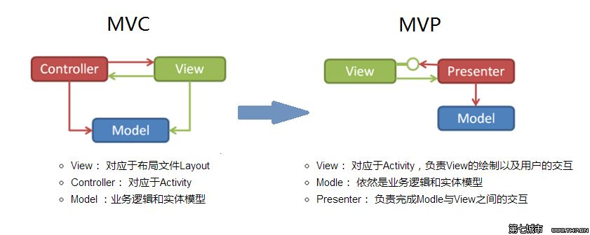

## Omi 5.0 发布 - Web 前端 MVVM 王者归来

<p align="center"></p>

### 写在前面

Omi 正式发布 5.0，依然专注于 View，但是对 MVVM 架构更加友好的集成，彻底分离视图与业务逻辑的架构。


你可以通过 omi-cli 快速体验 MVVM:

```bash
$ npm i omi-cli -g        
$ omi init-mvvm my-app    
$ cd my-app         
$ npm start                   
$ npm run build             
```

> `npx omi-cli init-mvvm my-app` 也支持(要求 npm v5.2.0+)

其他模板：

| **Template Type**|  **Command**|  **Describe**|
| ------------ |  -----------|  ----------------- |
|Base Template|`omi init my-app`| 基础模板|
|TypeScript Template(omi-cli v3.0.5+)|`omi init-ts my-app`|使用 TypeScript 的模板|
|[SPA Template](https://tencent.github.io/omi/packages/omi-router/examples/spa/build/)(omi-cli v3.0.10+)|`omi init-spa my-app`|使用  omi-router 单页应用的模板|
|omi-mp Template(omi-cli v3.0.13+)|`omi init-mp my-app`  |小程序开发 Web 的模板|

### MVVM 演化

MVVM 其实本质是由 MVC、MVP 演化而来。



目的都是分离视图和模型，但是在 MVC 中，视图依赖模型，耦合度太高，导致视图的可移植性大大降低，在 MVP 模式中，视图不直接依赖模型，由 P(Presenter)负责完成 Model 和 View 的交互。MVVM 和 MVP 的模式比较接近。ViewModel 担任这 Presenter 的角色，并且提供 UI 视图所需要的数据源，而不是直接让 View 使用 Model 的数据源，这样大大提高了 View 和 Model 的可移植性，比如同样的 Model 切换使用 Flash、HTML、WPF 渲染，比如同样 View 使用不同的 Model，只要 Model 和 ViewModel 映射好，View 可以改动很小甚至不用改变。

### Mapper

当然 MVVM 这里会出现一个问题, Model 里的数据映射到 ViewModel 提供该视图绑定，怎么映射？手动映射？自动映射？在 ASP.NET MVC 中，有强大的 [AutoMapper](https://www.c-sharpcorner.com/UploadFile/tirthacs/using-automapper-in-mvc/) 用来映射。针对 JS 环境，我特地封装了 [mapper.js](https://github.com/Tencent/omi/tree/master/packages/mappingjs) 用来映射 Model 到 ViewModel。

```js
const testObj = {
  same: 10,
  bleh: 4,
  firstName: 'dnt',
  lastName: 'zhang',
  a: {
    c: 10
  }
}

const vmData = mapper({
  from: testObj,
  to: { aa: 1 },
  rule: {
    dumb: 12,
    func: function () {
      return 8
    },
    b: function () {
      //可递归映射
      return mapper({ from: this.a })
    },
    bar: function () {
      return this.bleh
    },
    //可以重组属性
    fullName: function () {
      return this.firstName + this.lastName
    },
    //可以映射到 path
    'd[2].b[0]': function () {
      return this.a.c
    }
  }
})
```

你可以通后 npm 安装使用:

```js
npm i mappingjs
```

再举例说明：

```js
var a = { a: 1 }
var b = { b: 2 }

assert.deepEqual(mapping({
  from: a,
  to: b
}), { a: 1, b: 2 })
```

Deep mapping:

```js

QUnit.test("", function (assert) {
  var A = { a: [{ name: 'abc', age: 18 }, { name: 'efg', age: 20 }], e: 'aaa' }
  var B = mapping({
    from: A,
    to: { d: 'test' },
    rule: {
      a: null,
      c: 13,
      list: function () {
        return this.a.map(function (item) {
          return mapping({ from: item })
        })
      }
    }
  })

  assert.deepEqual(B.a, null)
  assert.deepEqual(B.list[0], A.a[0])
  assert.deepEqual(B.c, 13)
  assert.deepEqual(B.d, 'test')
  assert.deepEqual(B.e, 'aaa')
  assert.deepEqual(B.list[0] === A.a[0], false)
})
```

Deep deep mapping:

```js

QUnit.test("", function (assert) {
  var A = { a: [{ name: 'abc', age: 18, obj: { f: 'a', l: 'b' } }, { name: 'efg', age: 20, obj: { f: 'a', l: 'b' } }], e: 'aaa' }
  var B = mapping({
    from: A,
    rule: {
      list: function () {
        return this.a.map(function (item) {
          return mapping({
            from: item, rule: {
              obj: function () {
                return mapping({ from: this.obj })
              }
            }
          })
        })
      }
    }
  })

  assert.deepEqual(A.a, B.list)
  assert.deepEqual(A.a[0].obj, B.list[0].obj)
  assert.deepEqual(A.a[0].obj === B.list[0].obj, false)
})
```

### Omi MVVM Todo 实战

定义 Model:

```js
let id = 0

export default class TodoItem {
  constructor(text, completed) {
    this.id = id++
    this.text = text
    this.completed = completed || false

    this.author = {
      firstName: 'dnt',
      lastName: 'zhang'
    }
  }

  clone() {
    return new TodoItem(this.text, this.completed)
  }
}
```

Todo 就省略不贴出来了,太长了，可以直接 [看这里](https://github.com/Tencent/omi/blob/master/packages/omi-cli/template/mvvm/src/model/todo/todo.js)。反正统一按照面向对象程序设计进行抽象和封装。

定义 ViewModel:

```js
import mapper from './mapper'
import shared from './shared'
import todoModel from '../model/todo'
import ovm from './other'

class TodoViewModel {
  constructor() {
    this.data = {
      items: []
    }
  }

  update(todo) {
    //这里进行映射
    todo &&
      todo.items.forEach((item, index) => {
        this.data.items[index] = mapper({
          from: item,
          to: this.data.items[index],
          rule: {
            fullName: function() {
              return this.author.firstName + this.author.lastName
            }
          }
        })
      })

    this.data.projName = shared.projName
  }

  add(text) {
    todoModel.add(text)
    this.update(todoModel)
    ovm.update()
    this.update()
  }
  
  getAll() {
    todoModel.getAll(() => {
      this.update(todoModel)
      ovm.update()
      this.update()
    })
  }

  changeSharedData() {
    shared.projName = 'I love omi-mvvm.'
    ovm.update()
    this.update()
  }
}

const vd = new TodoViewModel()

export default vd
```

* vm 只专注于 update 数据，视图会自动更新
* 公共的数据或 vm 可通过 import 依赖


定义 View， 注意下面是继承自 ModelView 而非 WeElement。

```js
import { ModelView, define } from 'omi'
import vm from '../view-model/todo'
import './todo-list'
import './other-view'

define('todo-app', class extends ModelView {
  vm = vm

  onClick = () => {
    //view model 发送指令
    vm.changeSharedData()
  }

  install() {
    //view model 发送指令
    vm.getAll()
  }

  render(props, data) {
    return (
      <div>
        <h3>TODO</h3>
        <todo-list items={data.items} />
        <form onSubmit={this.handleSubmit}>
          <input onChange={this.handleChange} value={this.text} />
          <button>Add #{data.items.length + 1}</button>
        </form>
        <div>{data.projName}</div>
        <button onClick={this.onClick}>Change Shared Data</button>
        <other-view />
      </div>
    )
  }

  handleChange = e => {
    this.text = e.target.value
  }

  handleSubmit = e => {
    e.preventDefault()
    if(this.text !== ''){
      //view model 发送指令
      vm.add(this.text)
      this.text = ''
    }
  }
})
```

* 所有数据通过 vm 注入
* 所以指令通过 vm 发出

[→ 完整代码戳这里](https://github.com/Tencent/omi/tree/master/packages/omi-cli/template/mvvm/src)

### 小结

从宏观的角度来看，Omi 的 MVVM 架构也属性网状架构，网状架构目前来看有:

* Mobx + React
* Hooks + React
* MVVM (Omi) 

大势所趋！简直是前端工程化最佳实践！也可以理解成网状结构是描述和抽象世界的最佳途径。那么网在哪？

* ViewModel 与 ViewModel 之间相互依赖甚至循环依赖的网状结构
* ViewModel 一对一、多对一、一对多、多对多依赖 Models 形成网状结构
* Model 与 Model 之间形成相互依赖甚至循环依赖的网状结构
* View 一对一依赖 ViewModel 形成网状结构

总结如下：

|| Model| ViewModel|View|
|---|----|----|-----|
|Model|多对多|多对多|无关联|
|ViewModel|多对多|多对多|一对一|
|View|无关联|一多一|多对多|


## Star & Fork

* [https://github.com/Tencent/omi](https://github.com/Tencent/omi)