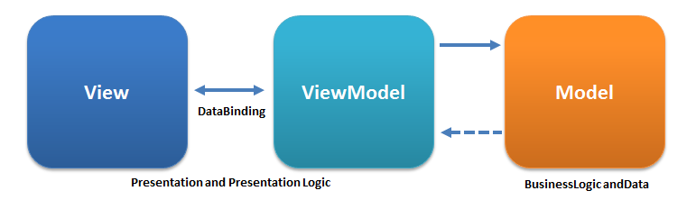
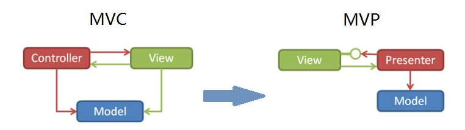

## Omi 5.0 Released - MVVM comes back bravely

### Written in front

Omi officially released 5.0, still focusing on View, but more friendly integration of MVVM architecture, a complete separation of view and business logic architecture.



You can quickly experience MVVM through omi-cli:

```bash
$ npm i omi-cli -g        
$ omi init-mvvm my-app    
$ cd my-app         
$ npm start                   
$ npm run build             
```

or:

> `npx omi-cli init-mvvm my-app` (npm v5.2.0+)

Other templates:

| **Template Type**|  **Command**|  **Describe**|
| ------------ |  -----------|  ----------------- |
|Base Template|`omi init my-app`| Basic template for omi project.|
|TypeScript Template(omi-cli v3.0.5+)|`omi init-ts my-app`|Basic template with typescript.|
|[SPA Template](https://tencent.github.io/omi/packages/omi-router/examples/spa/build/)(omi-cli v3.0.10+)|`omi init-spa my-app`|Single page application template with omi-router.|
|omi-mp Template(omi-cli v3.0.13+)|`omi init-mp my-app`  |Developing web with mini program template.|

### MVVM evolution

MVVM is actually evolved from MVC and MVP.



The purpose is to separate views and models, but in MVC, views depend on models, and the degree of coupling is too high, which leads to a great reduction in the portability of views. In MVC, views do not depend on models directly, and P(Presenter) is responsible for completing the interaction between Models and Views. MVVM and MVP are similar. ViewModel plays the role of Presenter and provides the data source needed for UI view, instead of directly letting View use the data source of Model. This greatly improves the portability of View and Model, such as using Flash, HTML, WPF rendering for the same model switch, such as using different models for the same View. As long as the Model and ViewModel are mapped well, View can be changed very little or not.

### Mappingjs

Of course, there is a problem with MVVM. Data in Model is mapped to ViewModel to provide the view binding. How to map? Manual mapping? Automatic mapping? In ASP.NET MVC, there are powerful [AutoMapper](https://www.c-sharpcorner.com/UploadFile/tirthacs/using-automapper-in-mvc/) for mapping. For the JS environment, I specially encapsulated [mappingjs](https://github.com/Tencent/omi/tree/master/packages/mappingjs) to map Model to ViewModel.

```js
const testObj = {
  same: 10,
  bleh: 4,
  firstName: 'dnt',
  lastName: 'zhang',
  a: {
    c: 10
  }
}

const vmData = mapping({
  from: testObj,
  to: { aa: 1 },
  rule: {
    dumb: 12,
    func: function () {
      return 8
    },
    b: function () {
      //Recursive mapping
      return mapping({ from: this.a })
    },
    bar: function () {
      return this.bleh
    },
    //You can reorganize attributes.
    fullName: function () {
      return this.firstName + this.lastName
    },
    //Can be mapped to path
    'd[2].b[0]': function () {
      return this.a.c
    }
  }
})
```

Install mappingjs via npm:

```js
npm i mappingjs
```

Simple mapping：

```js
var a = { a: 1 }
var b = { b: 2 }

assert.deepEqual(mapping({
  from: a,
  to: b
}), { a: 1, b: 2 })
```

Deep mapping:

```js

QUnit.test("", function (assert) {
  var A = { a: [{ name: 'abc', age: 18 }, { name: 'efg', age: 20 }], e: 'aaa' }
  var B = mapping({
    from: A,
    to: { d: 'test' },
    rule: {
      a: null,
      c: 13,
      list: function () {
        return this.a.map(function (item) {
          return mapping({ from: item })
        })
      }
    }
  })

  assert.deepEqual(B.a, null)
  assert.deepEqual(B.list[0], A.a[0])
  assert.deepEqual(B.c, 13)
  assert.deepEqual(B.d, 'test')
  assert.deepEqual(B.e, 'aaa')
  assert.deepEqual(B.list[0] === A.a[0], false)
})
```

Deep deep mapping:

```js

QUnit.test("", function (assert) {
  var A = { a: [{ name: 'abc', age: 18, obj: { f: 'a', l: 'b' } }, { name: 'efg', age: 20, obj: { f: 'a', l: 'b' } }], e: 'aaa' }
  var B = mapping({
    from: A,
    rule: {
      list: function () {
        return this.a.map(function (item) {
          return mapping({
            from: item, rule: {
              obj: function () {
                return mapping({ from: this.obj })
              }
            }
          })
        })
      }
    }
  })

  assert.deepEqual(A.a, B.list)
  assert.deepEqual(A.a[0].obj, B.list[0].obj)
  assert.deepEqual(A.a[0].obj === B.list[0].obj, false)
})
```

### Omi MVVM Todo 

Define Model:

```js
let id = 0

export default class TodoItem {
  constructor(text, completed) {
    this.id = id++
    this.text = text
    this.completed = completed || false

    this.author = {
      firstName: 'dnt',
      lastName: 'zhang'
    }
  }

  clone() {
    return new TodoItem(this.text, this.completed)
  }
}
```

Todo is omitted and not posted. Todo is too long to be directly [see here](https://github.com/Tencent/omi/blob/master/packages/omi-cli/template/mvm/src/model/todo/todo.js). Anyway, they are abstracted and encapsulated according to object-oriented programming.

Define ViewModel:

```js
import mapping from 'mappingjs'
import shared from './shared'
import todoModel from '../model/todo'
import ovm from './other'

class TodoViewModel {
  constructor() {
    this.data = {
      items: []
    }
  }

  update(todo) {
    //Model and ViewModel mapping here
    todo &&
      todo.items.forEach((item, index) => {
        this.data.items[index] = mapping({
          from: item,
          to: this.data.items[index],
          rule: {
            fullName: function() {
              return this.author.firstName + this.author.lastName
            }
          }
        })
      })

    this.data.projName = shared.projName
  }

  add(text) {
    todoModel.add(text)
    this.update(todoModel)
    ovm.update()
  }
  
  getAll() {
    todoModel.getAll(() => {
      this.update(todoModel)
      ovm.update()
    })
  }

  changeSharedData() {
    shared.projName = 'I love omi-mvvm.'
    ovm.update()
    this.update()
  }
}

const vd = new TodoViewModel()

export default vd
```

* VM only focuses on update data, and views are automatically updated
* Common data or VM can depend on import


Define View, note that the following inherits from ModelView not WeElement.

```js
import { ModelView, define } from 'omi'
import vm from '../view-model/todo'
import './todo-list'
import './other-view'

define('todo-app', class extends ModelView {
  vm = vm

  onClick = () => {
    //view model send action
    vm.changeSharedData()
  }

  install() {
    //view model send action
    vm.getAll()
  }

  render(props, data) {
    return (
      <div>
        <h3>TODO</h3>
        <todo-list items={data.items} />
        <form onSubmit={this.handleSubmit}>
          <input onChange={this.handleChange} value={this.text} />
          <button>Add #{data.items.length + 1}</button>
        </form>
        <div>{data.projName}</div>
        <button onClick={this.onClick}>Change Shared Data</button>
        <other-view />
      </div>
    )
  }

  handleChange = e => {
    this.text = e.target.value
  }

  handleSubmit = e => {
    e.preventDefault()
    if(this.text !== ''){
      //view model send action
      vm.add(this.text)
      this.text = ''
    }
  }
})
```

* All data is injected through VM
* So instructions are sent through VM

[→ All the source code](https://github.com/Tencent/omi/tree/master/packages/omi-cli/template/mvvm/src)

### Summary

From a macro perspective, Omi's MVVM architecture also has attributed mesh architecture. At present, mesh architecture has:

* Mobx + React
* Hooks + React
* MVVM (Omi) 

General trend! It's a best practice for front-end engineering! It can also be understood as the best way to describe and abstract the world. Where is the net?

* ViewModel and ViewModel are interdependent or even cyclically dependent mesh structures
* ViewModel is one-to-one, many-to-one, one-to-many, and many-to-many dependent Models to form a network structure
* Models and Models form interdependent and even cyclically dependent meshes
* View relies one-to-one on ViewModel to form a mesh structure

Summarized as follows:

| | Model | ViewModel  | View |
|---|-----|--------|---------|
|Model | many-to-many | many-to-many | unrelated |
|ViewModel | many-to-many | many-to-many | one-to-one |
|View | unrelated |  one-to-one|  many-to-many |

## Star & Fork

* [https://github.com/Tencent/omi](https://github.com/Tencent/omi)