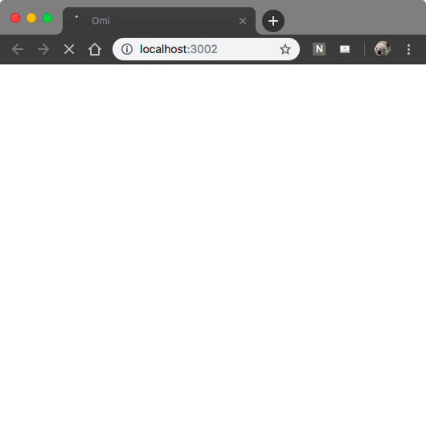
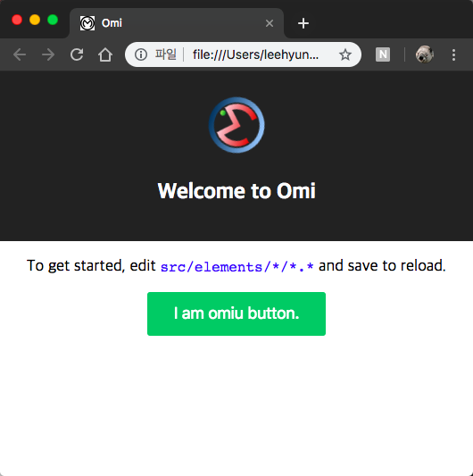
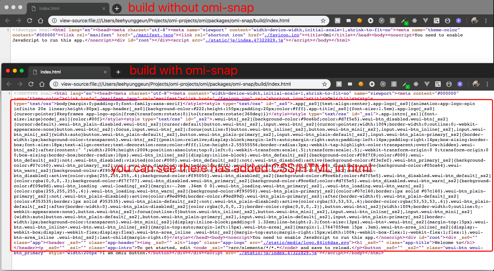
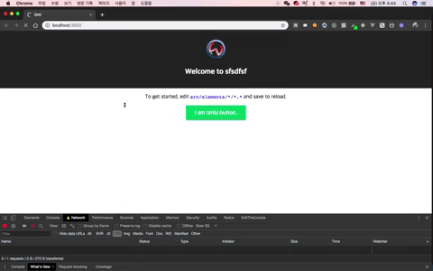
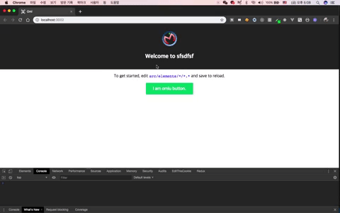

# Omi Snap - 做Prerender的Snap模版

诸如Omi之类的JavaScript框架在JavaScript下载之前没有显示任何内容。 因此，用户会在一段时间内看到空白页面，获得糟糕的用户体验。 Omi Snap解决了这个问题，在构建中加入了标记（HTML / CSS），因此用户可以在下载JavaScript文件时看到UI内容，从而获得更好的用户体验。

---

## Usage

```bash
$ npm i -g omi-cli # 安装omi-cli
$ omi init-snap myapp # 用omi-cli生成omi-snap模版
$ cd myapp
$ npm run build # 建立模版 - 自动加入标记
```

## 什么是Snap(Prerender)？
`omi-cli`创建一个默认的`omi`模板，HTML是一个空白，因为所有都是由JavaScript呈现的。

```html
<!doctype html>
<html lang="en">
  <head>
    <meta charset="utf-8">
    <meta name="viewport" content="width=device-width,initial-scale=1,shrink-to-fit=no">
    <meta name="theme-color" content="#000000">
    <link rel="manifest" href="./manifest.json">
    <link rel="shortcut icon" href="./favicon.ico">
    <title>Omi</title>
  </head>
  <body>
    <noscript>You need to enable JavaScript to run this app.</noscript>
    <div id="root"></div>
    <script src="./static/js/index.bb813127.js"></script>
  </body>
</html>
```

所以你打开页面的话，加载JavaScript文件之前会看到空的页面。



但，`omi-snap`是用snap功能加入标记(HTML/CSS)，然后产生HTML文件。所以你打开页面后至少可以看到基本的内容。



看如下照片，可以知道用snap生成的模版会有标记(HTML/CSS)。



## Omi模版和Omi Snap模版有什么区别

Omi模板

打开页面后只能看到空的页面，等几秒后才能看到内容。



Omi Snap模板

打开后，可以马上看到内容。



## 开始吧

[→ omi-snap Github](https://github.com/Tencent/omi/tree/master/packages/omi-snap)

[→ omi-snap template Github](https://github.com/omijs/template-snap)