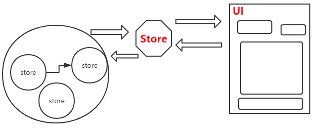

## Omix 框架 Store 体系补充

先回顾下主要观点:

	Omix Store 体系是用来管理程序所有数据以及数据的逻辑，顺便输出给 UI。

除了纯粹视觉的软件，所以百分之99的软件的本质就是就是数据的流动，UI 只是辅助数据更友好地流动，更符合逻辑地流动。架构如下图所示:



所有大部分数据都可以从 this.$store 取到。一些公共组件可以使用标签声明的方式获取数据，因为组件内部直接使用 this.$store 获取数据的话污染了组件的纯粹性，比如分页组件，一定是通过标签直接传递数据，而不是内部从 $store 取(但是可以从外部使用$store传入，比如下面的 total):

```js
<Pagination
	total={this.$store.total}
	pageSize={10}
	numEdge={1}
	numDisplay={4}
	onPageChange={this.handlePageChange.bind(this)} >
</Pagination>
```

分页组件内部只从 data 拿去数据。

还有一类情况，组件会被使用多次，也必须使用声明的方式，比如上一篇的例子:

```js
class TodoList extends Omi.Component {
    render() {
        return (
            <ul>
                {this.data.items.map(item => (
                    <li key={item.id}>{item.text}</li>
                ))}
            </ul>
        )
    }
}

class TodoApp extends Omi.Component {
    constructor(data) {
        super(data)
    }

    render() {
        return <div>
            <TodoList items={this.$store.itemsA}></TodoList>
            <TodoList items={this.$store.itemsB}></TodoList>
        </div>
    }
}

```
TodoList 被使用了两次，或者多次。TodoList内部不可能直接去书写 this.$store.itemsA 或者 this.$store.itemsB。

所以在真实的项目中，Store 架构也是可以看到标签上声明式地传递数据，很正常也很必须。
