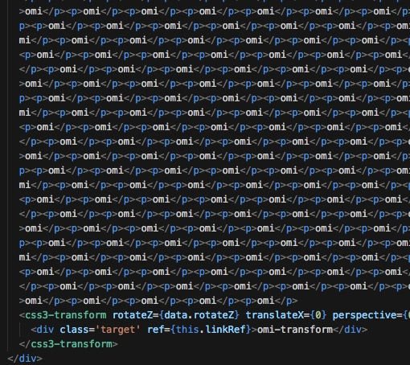
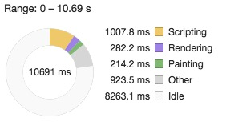
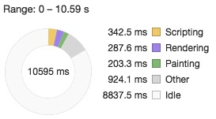

## Omi 60FPS Web 애니메이션 채택

[Omi 프레임워크](https://github.com/Tencent/omi/) 정식 배포 [→ omi-transform](https://github.com/Tencent/omi/tree/master/packages/omi-transform).

> Made css3 transform super easy. Made 60 FPS easy.


Omi Transform 은 특수 모션 솔루션으로 Omi 프로젝트에서 CSS Transform 설정을 쉽고 빠르게 할 수 있습니다. css3transform은 모바일 웹 모션 솔루션으로 많은 프로젝트에서 사용되고 있습니다. 또한 위챗 과 QQ 모바일 버전에도 광대하게 사용되고 있습니다. 그리고 근본적인 DOM 애트리뷰트 **수정**을위해 편리한 기능들을 제공합니다.

[css3transform 공식 홈페이지](https://tencent.github.io/omi/packages/omi-transform/css3transform/) 를 통해 빠르게 확인할 수 있습니다.

공식 웹사이트의 예는 Native JS를 사용한 예이고이고 css3transform의 React 버전도 있습니다. 그래서 React 의 선언적 프로그래밍 방식으로도 css3transform 을 사용할 수 있습니다:

``` js
render() {
    return (
        <Transform
          translateX={100}
          scaleX={0.5}
          originX={0.5}>
          <div>Transform DOM</div>
        </Transform>
    )
}
```

중요한 부분은 omi-transform 입니다.

## omi-transform 3분 마스터

### NPM Install

``` js
npm install omi-transform
```

### Usage


```js
import { render, WeElement, define } from "omi"
import "omi-transform"

define("my-app", class extends WeElement {
  static observe = true

  install() {
    this.data.rotateZ = 30
    this.linkRef = (e) => {
      this.animDiv = e
    }
  }

  installed() {
    setInterval(() => {
      //slow
      // this.data.rotateZ += 2

      //fast
      this.animDiv.rotateZ += 2
      //sync for update call of any scenario
      this.data.rotateZ = this.animDiv.rotateZ
    }, 16)
  }

  render(props, data) {
    return (
      <css3-transform rotateZ={data.rotateZ} translateX={0} perspective={0} >
        <div ref={this.linkRef}>
          omi-transform
        </div>
      </css3-transform>
    )
  }
})

render(<my-app />, "body")
```

* 이동해야 하는 DOM에 대해 `<css3-transform></css3-transform>`을 사용하세요.
* DOM을 직접 조작하기 위해 css3transform을 사용해야하는 DOM 에 `ref`를 사용하세요.
* this.refs.animDiv를 사용하여 구성 요소기능에서 css transform 등록 정보를 읽거나 설정할 수 있습니다.
* this.refs.xxx 는 "translateX", "translateY", "translateZ", "scaleX", "scaleY", "scaleZ", "rotateX", "rotateY", "rotateZ", "skewX", "skewY", "originX", "originY", "originZ", "perspective" 를 지원하며. 이러한 속성은 설정되고 읽기가 가능합니다.
* perspective는 투영되는 시야의 거리를 표시합니다.

컴포넌트의 DOM의 동작이 있을때 기타 로직의 변경때문에 업데이트 될것입니다. 아마 User Interaction 혹은 데이터 반환을 위한 콜백일 수 있습니다. 따라서 업데이트 전후에 DOM 상태를 유지하는 것이 매우 중요합니다. 그렇지 않으면 깜빡임, 혹은 기타 디스플레이 관련 로직 오류가 발생할 것입니다.

위 코드가 DOM 동작중에 Diff를 수행하지 않는다는 것을 알수있습니까? 구성 요소가 업데이트되지 않았습니까? 구성 요소 업데이트의 경우 모든 모션 상태가 손실되지 않습니까? Omi는 어떻게 이 문제를 해결할까요? 위의 코드는 이 문제에 답을주었습니다.

> `this.data.rotateZ`를 사용하여 DOM 모션의 상태를 동기화 하여 우발적인 새로고침(`update`)를 방지합니다.

[→ 데모](https://tencent.github.io/omi/packages/omi/examples/css3transform/)

## 지원 프로퍼티

| **Property**    | **Describe**                           |
| --------- | ---------------------- |
| translateX |translateX |
| translateY |translateY |
| translateZ |translateZ |
| scaleX |scaleX |
| scaleY |scaleY |
| scaleZ |scaleZ|
| rotateX |rotateX |
| rotateY |rotateY |
| rotateZ |rotateZ |
| skewX | skewX|
| skewY |skewY |
| originX |  the basic x point of rotation|
| originY | the basic y point of rotation |
| originZ |  the basic z point of rotation|
| perspective |Perspective projection distance |

get 과 set 사용 가능.

## 성능 비교

React 버전에서는 diff 프로세스가 있고 diff 프로세스에 DOM 프로세스를 적용하기 때문에 상태 변경은 전체 innerHTML을 대체하지 않으므로 브라우저 렌더링에는 여전히 저렴하지만 js의 diff 프로세스는 여전히 Profile로 이동해야합니다. 그래서 심각한 경우 웹 워커가 실행되지 않으면 UI 스레드가 중단되어 애니메이션 프레임을 잃거나 인터렉션이 지연되는 등의 문제가 발생할 수 있습니다. 따라서 CPU의 소비시간을 살펴보는 것이 필요합니다.

다음 데이터는 두 가지 방법으로 크롬 Profiles를 사용하여 omi-transform 과 react-transform 을 비교 합니다.

**총 소요 시간 비교**：

react-transform：


omi-transform：


- React 는 9739ms 내에 CPU를 대략 **1686ms** 소비합니다.
- Omi 는 9254ms 내에 CPU를 대략 **700ms** 소비합니다.

Profiles 이 없으면 State 가 React Lifecycle을 거치기 때문에 느려질 것이라고 생각 하지만 React에서 소요된 시간은 여전히 수용 가능할 정도이며 생각보다 느려지지 않습니다.

Omi 는 거의 전통적인 Native JS와 같습니다. 왜냐하면 모션이 있을때 DOM Diff 를 하지 않고 직접 DOM 을 처리하기 때문입니다!!

## Omi 자기비교

```js
//slow
this.data.rotateZ += 2
this.update()
```

```js
//fast
this.animDiv.rotateZ += 2
this.data.rotateZ = this.animDiv.rotateZ
```

위의 두 코드의 효율성을 주로 비교해주세요. 크롬의 Performance 탭을 열어 10초 정도 작동후 Summary 를 열어 비교해주세요:

| **Slow**                         | **Fast**                           |
| ------------------------------- | ----------------------------------- |
|  |  |

Omi 는 10초 정도 걸리는 두 가지 방식에서 모두 고성능인 것을 볼 수 있습니다. 그리고 Fast 방식은 확실히 더 빠르고, Scripting 의 소요시간은 더 적게 듭니다. 장점이 분명하지 않나요? 왜냐하면 DOM 조작 방식이 간단하기 때문입니다. 만약 DOM 조작 방식이 복잡하다면 Fast 방식은 직접 Slow 방식의 많은 부분을 제거할 것입니다! 아래에서 확인해 보겠습니다!

첫번째 렌더링의 DOM 구조가 복잡하게 수정되었습니다:



크롬의 Performance를 10 초 정도 실행하고 Summary 를 열어 비교해주세요:

| **Slow**                         | **Fast**                           |
| ------------------------------- | ----------------------------------- |
|  |  |

Scripting Time 의 갭이 더 커진것을 볼수 있습니다!

전후 데이터 비교:

|DOM 구조| **Slow**                         | **Fast**                           |
|-----------| ------------------------------- | ----------------------------------- |
|Simple|  |  |
|Complex|  |  |

Fast 는 Simple 한 DOM 과 Complex 한 DOM에서 큰 차이가 없는 것을 볼 수 있습니다. 그리고 Slow는 두 테스트에서 큰 차이가 있는 것을 볼 수 있습니다. 그렇다면 Fast 핵심 css3transform 원리는 무엇일까요?

## css3transform

## Install
```js
npm install css3transform
```

## API
```js
Transform(domElement, [notPerspective])
```

위 코드를 호출하여 domElement 의 아래 속성들을 설정하고 읽을 수 있습니다.
"translateX", "translateY", "translateZ", "scaleX", "scaleY", "scaleZ", "rotateX", "rotateY", "rotateZ", "skewX", "skewY", "originX", "originY", "originZ"！

간단합니다.

## 사용 예제

```js
Transform(domElement)//or Transform(domElement, true)

//set

domElement.translateX = 100;
domElement.scaleX = 0.5;
domElement.originX = 50;

//get

console.log(domElement.translateX )
```

## 전통적인 CSS3 프로그래밍의 문제
이전에 우리는 animate.css, zepto/jQuery의 animate 를 사용하거나 tween.js + css3 를 사용하여 인터렉티브 프로그래밍을 했습니다. 이 부분에는 세 가지 단점이 있습니다:

- 직관적이지 않음
- 직접 조작하는것이 아님
- 사용하기 불편함

### 직관적이지 않음

아래의 이미지를 봐주세요:

 순서는 결과에 영향을 미치며 직관적이지 않습니다. 그러면 왜 이 결과가 나오는 걸까요? new WebKitCSSMatrix(transform_str)를 통해 최종 matrix를 비교할 수 있습니다.

이것은 Matrix 교환 법칙을 따르지 않는다는 것을 직접적으로 나타냅니다. `A * B != B * A`

## 직접 조작하는것이 아님
zepto 예제:
```js
$("#some_element").animate({
  opacity: 0.25, left: '50px',
  color: '#abcdef',
  rotateZ: '45deg', translate3d: '0,10px,0'
}, 500, 'ease-out')
 ```

translate3d: '0,10px,0'는 매우 불편하며 점점 제어할 방법이 없습니다. 일부 모션 혹은 시간 라이브러리를 사용한 프로그래밍은 말할것도 없습니다. 어쩌면 당신은 'ease-out' 을 사용하면 되지 않냐고 말할 수 있습니다. 그러나 x 와 y 및 z 를 서로 다른 transform 함수에 각각 대응시켜야 한다면 이런 형식의 문자열 기반 프로그래밍은 어려울 것입니다.
또한 zepto의 순서가 결과에도 영향을 줍니다. 마침내 DOM 요소에 지정된 string으로 철자가 지정되었기 때문이죠.

tween.js 예제:

```js
var position = { x: 100, y: 100, rotation: 0 },
    target = document.getElementById('target')
     new TWEEN.Tween(position)
    .to({ x: 700, y: 200, rotation: 359 }, 2000)
    .delay(1000)
    .easing(TWEEN.Easing.Elastic.InOut)
    .onUpdate(function update() {
        var t_str= 'translateX(' + position.x + 'px) translateY(' + position.y + 'px) rotate(' + Math.floor(position.rotation) + 'deg)';
        element.style.transform = element.style.msTransform = element.style.OTransform = element.style.MozTransform = element.style.webkitTransform = t_str
    })
```

문자열 방식을 사용하면 그것을 볼때 피곤할 것입니다. 그리고 얼마나 많은 이런 코드를 작성해야하는지는 말할것도 없습니다.

animate.css 예제:
```css
@keyframes pulse {
  from {
    -webkit-transform: scale3d(1, 1, 1);
    transform: scale3d(1, 1, 1);
  }
   50% {
    -webkit-transform: scale3d(1.05, 1.05, 1.05);
    transform: scale3d(1.05, 1.05, 1.05);
  }
   to {
    -webkit-transform: scale3d(1, 1, 1);
    transform: scale3d(1, 1, 1);
  }
}
```

animate.css는 일련의 키 프레임 애니메이션을 캡슐화하고 개발자는 관련 애니메이션 클래스를 추가하거나 제거하는 데 신경을 써야 합니다. 이것은 인터렉션 효과는 어느정도 뛰어나지만 결함이 있을것입니다:

- 프로그래밍 효율이 떨어짐
- 간단한 변형에 적합
- `end` 콜백만 있고, `change` 콜백이 없음

## 사용하기 불편함

transform의 회전점은 기본적으로 중심으로 설정되지만 때로는 중심이 아닙니다. 우리의 전통적인 방법은 transform-origin을 사용하여 기준점을 설정하는 것입니다.


주의: 다른 transform-origin 속성은 transform이 아닙니다. 그러나 transform-origin이 필요하지 않나요? 이런 디자인은 폐기되지 않았나요? 모션 origin의 장면이 필요하지 않나요? 이 부분은 게임 설계중 종종 사용되는데 이 부분은 이후에 따로 얘기해보도록 하겠습니다. 사실 어떤 효과를 내기 위해서는 원점을 이동해야하는 장면이 있습니다.


## 요약

위의 불편함을 기반으로 css3transform 이 있습니다!

- css3transform은 CSS3 transform에 집중한 읽고 설정할수 있는 매우 가벼운 JS 라이브러리이며 CSS3 transform의  프로그래밍성을 크게 향상시킵니다.
- css3transform 은 매우 추상적이어서 시간 또는 모션 프레임과 함께 번들로 제공되지 않으므로 모든 시간 및 동작 프레임워크에서 쉽게 사용할수 있습니다.
- css3transform 은 matrix3d를 DOM객체의 최종 출력으로 사용하지만 하드웨어 가속은 프로그래밍 기능을 잃지 않고 사용합니다.
- css3transform은 1분만에 쉽게 시작할 수 있는 API를 사용하고 2분 안에 프로젝트에 임베디드 됩니다.
- css3transform 은 transform 원래의 기능을 확장했습니다. transform origin에 편리함을 더했습니다.

## 실전


createjs 의 tweenjs를 사용하여 스윙 효과를 쉽게 만들수 있습니다:

```js
var element = document.querySelector("#test")
Transform(element)
element.originY = 100
element.skewX = -20

var Tween = createjs.Tween,
    sineInOutEase = createjs.Ease.sineInOut;
Tween.get(element, {loop: true}).to({scaleY: .8}, 450, sineInOutEase).to({scaleY: 1}, 450, sineInOutEase)
Tween.get(element, {loop: true}).to({skewX: 20}, 900, sineInOutEase).to({skewX: -20}, 900, sineInOutEase)
```

위의 코드는 요약된 것입니다. 아래에 설명이 있습니다：

- 엘리먼트의 초기 skewX는 scale속도와 맞추기 위해 -20입니다.
- 엘리먼트의 originY는 펭귄의 bottom center를 기준점으로 하기 위해 100 입니다.

보시다시피 css3transform은 매우 추상적이어서 아무런 문제 없이 tweenjs 와 함께 사용할 수 있습니다.

## 원리

css3transform은 CSS3 transform 을 DOM 엘리먼트와 혼합할 수 있을뿐만 아니라 모든 객체 리터럴에 혼합할 수 있습니다. 또한, css3transform을 도구로 상요할 수 있으며 몇 가지 기본적인 수학 기능들을 제공합니다.

> 여기서는 특별히 주의를 해줘야 합니다. 이전 방법을 계속 사용할 수 있지만, 여기에는 세 가지 다른 사용 방법이 있습니다.

#### 문법1

 ```js
Transform(obj, [notPerspective])
```

보시다시피 변경할 수 있는 다른 방법이 없습니다. 오직 첫번째 파라미터만 DOM 엘리먼트를 전달하거나 객체 리터럴을 전달할 수 있습니다.

조바심낼 필요 없이 먼저 사용해 봅시다.


```js
var element = document.querySelector("#test"),
    obj = {}

Transform(obj)

obj.rotateZ = 90

element.style.transform = element.style.msTransform = element.style.OTransform = element.style.MozTransform = element.style.webkitTransform = obj.transform
```
DOM 엘리먼트 뿐만 아니라 객체리터럴도 전달할 수 있는 것을 볼 수 있습니다. 위의 obj.transform 으로 90도 회전을 시킬수 있습니다. 그래서 출력되는 matrix는 다음과 같습니다:

```js
perspective(500px) matrix3d(0,1,0,0,-1,0,0,0,0,0,1,0,0,0,0,1)
```

댜음과 같은 원근 투영도 해제할 수 있습니다:

```js
var element = document.querySelector("#test"),
    obj = {};
//원근투영해제
Transform(obj, true)

obj.rotateZ = 90;

lement.style.transform = element.style.msTransform = element.style.OTransform = element.style.MozTransform = element.style.webkitTransform = obj.transform
```

출력된 matrix:

```js
matrix3d(0,1,0,0,-1,0,0,0,0,0,1,0,0,0,0,1)
```

그렇다면 transform의 방법은 어떻습니까? [tween.js](https://github.com/tweenjs/tween.js)의 예는 다음과 같습니다:
```js
var element = document.querySelector("#test"),
    obj = { translateX: 0, translateY: 0 }

Transform(obj)
var tween = new TWEEN.Tween(obj)
    .to({ translateX: 100, translateY: 100 }, 1000)
    .onUpdate(function () {
        element.style.transform = element.style.msTransform = element.style.OTransform = element.style.MozTransform = element.style.webkitTransform = obj.transform
    })
    .start()

requestAnimationFrame(animate)

function animate(time) {
    requestAnimationFrame(animate)
    TWEEN.update(time)
}
```

그럼 전통적인 방법을 사용하면 어떨까요?


 ```js
var element = document.querySelector("#test")
Transform(element)
var tween = new TWEEN.Tween({ translateX: element.translateX, translateY: element.translateY })
    .to({ translateX: 100, translateY: 100 }, 1000)
    .onUpdate(function () {
        element.translateX = this.translateX
        element.translateY = this.translateY
    })
    .start()

requestAnimationFrame(animate)

function animate(time) {
    requestAnimationFrame(animate)
    TWEEN.update(time)
}
```

TWEEN.Tween 은 모든 애트리뷰트를 탐색하고 초기 변수를 설정합니다:
```js
 // Set all starting values present on the target object
for (var field in object) {
    _valuesStart[field] = parseFloat(object[field], 10)
}
```

그래서 바로 new TWEEN.Tween(element)를 사용할 수 없습니다.
왜냐하면 시작전에, 모든 필요한 애트리뷰트를 수집하고 나서 시작하기 때문입니다. 우리는 간단한 방법을 지원하기 위해 tween을 encapsulate 할수 있습니다:
```js
var Tween = function (obj) {
    this.obj = obj;
    return this;
}

Tween.prototype = {
    to: function (targets, duration, easing) {
        this.duration = duration;
        this.targets = targets;
        return this;
    },
    start: function () {
        this.startTime = new Date()
        this._beginTick()
    },
    _beginTick: function () {
        var _startValues = {},
            targets = this.targets;
        for (var key in targets) {
            if (targets.hasOwnProperty(key)) {
                _startValues[key] = this.obj[key];
            }
        }
        var self  = this;
        this._interval = setInterval(function () {
            var dt = new Date() - self.startTime;
            for (var key in targets) {
                if (targets.hasOwnProperty(key)) {
                    if (dt >= self.duration) {
                        clearInterval(self._interval)
                    } else {
                        var p = dt / self.duration;
                        var dv = targets[key] - self.obj[key];
                        self.obj[key] += dv * p;
                    }
                }
            }
        }, 15)
     }
}
```

여기에 간단하게 setInterval을 사용해서 loop를 진행합니다. 물론 다른 방식으로 바꿀수도 있습니다. 지금은 다음과 같은 방법으로 사용할수 있습니다:
```js
var element = document.querySelector("#test")
Transform(element)
var tween = new Tween(element)
    .to({ translateX: 100, translateY: 100 }, 1000)
    .start()
```
당연히 이것은 조금 포인트에서 벗어나있습니다. 이것은 단지 DOM을 직접 사용해서 마운트하는 것과 서드파티 오브젝트를 사용해서 마운트 하는것을 비교하는 것입니다. 서드파티 마운트는 조금 산을 오르는 느낌이 들것입니다. 물론 아직 끝나지 않았습니다. 위의 방법을 사용할수 있을 뿐만 아니라 당신은 css3transform 을 computing 도구로 사용할 수 있습니다.

#### 문법2

```
Transform.getMatrix3D(option)
```

#### 방법

 ```js
var matrix3d = Transform.getMatrix3D({
    translateX: 0,
    translateY: 100,
    scaleX:2
})
console.log(matrix3d)
```
출력되는 결과는 다음과 같을 것입니다:


이 값들을 통해 당신이 하고싶은 모든것들을 할 수 있습니다. css3transform 소스코드를 보면 Transform.getMatrix3D로 지원되는 애트리뷰트들을 얻을수 있습니다:

 ```js
Transform.getMatrix3D = function (option) {
    var defaultOption = {
        translateX: 0,
        translateY: 0,
        translateZ: 0,
        rotateX: 0,
        rotateY: 0,
        rotateZ: 0,
        skewX: 0,
        skewY: 0,
        originX: 0,
        originY: 0,
        originZ: 0,
        scaleX: 1,
        scaleY: 1,
        scaleZ: 1
    };
    for (var key in option) {
    ...
    ...
    ...
 }
```

#### 문법3

```js
Transform.getMatrix2D(option)
```

3D matrix 뿐만아니라 css3transform 역시 2D 도구 함수를 지원합니다.

#### 방법
 ```js
var matrix2d = Transform.getMatrix2D({
    translateX: 0,
    translateY: 100,
    scaleX:2
})
console.log(matrix2d)
```
아래의 값들이 출력될 것입니다:


- a Horizontal Scale
- b Horizontal Stretch
- c Vertical Stretch
- d Vertical Scale
- tx Horizontal Move
- ty Vertical Move

그럼 구한 Matrix2D는 어디에 쓸까요?

- Scale：scale(sx, sy) 은 matrix(sx, 0, 0, sy, 0, 0) 와 같습니다
- Translate: translate(tx, ty) 은 matrix(1, 0, 0, 1, tx, ty) 와 같습니다
- Rotate：rotate(deg) 은 matrix(cos(deg), sin(deg), -sin(deg), cos(deg), 0, 0) 와 같습니다
- Skew：skew(degx, degy) 은 matrix(1, tan(degy), tan(degx), 1, 0, 0) 와 같습니다. 

css3transform 소스코드를 보면 Transform.getMatrix2D로 지원되는 애트리뷰트 값들을 얻을수 있습니다:

```js
Transform.getMatrix2D = function(option){
    var defaultOption = {
        translateX: 0,
        translateY: 0,
        rotation: 0,
        skewX: 0,
        skewY: 0,
        originX: 0,
        originY: 0,
        scaleX: 1,
        scaleY: 1
    };
    ...
    ...
    ...
}
```

## 주의 해야할 부분

Transform.getMatrix2D 와 Transform.getMatrix3D 모두 origin 특성을 지원합니다. transform-origin 과 작별하세요.
Transform.getMatrix2D 와 Transform.getMatrix3D는 전통적인 Math.tan을 하지 않고 skew를 구현합니다. 대신 회전의 절반입니다:

2d skew 예제:
```js
Math.cos(skewY), Math.sin(skewY), -Math.sin(skewX), Math.cos(skewX)
```

이전에 Tencent IEG (게임 개발 부서) 의 친구가 왜 half of rotation을 사용하는지 물어본적이 있습니다. 그리고 왜 Math.tan을 사용하지 않는지도요. 그 이유는: Math.tan는 특히 왜곡되어 무한한 값을 가지므로 화면 전체에 왜곡이 발생합니다.


그러나 half of rotation은 그렇지 않습니다.

## getMatrix2D는 유용할까요？

**DOM Transformation시, CSS3 3D transforms를 지원하지 않는 브라우저에서 할 수 있습니다**

예를들어, 일부 변환 속성을 CSS3 속성으로 쉽게 변환하여 DOM에 할당할 수 있습니다:

```js
var matrix = Transform.getMatrix2D({
    rotation: 30,
    scaleX: 0.5,
    scaleY: 0.5,
    translateX: 100
})
ele.style.transform = ele.style.msTransform = ele.style.OTransform = ele.style.MozTransform = ele.style.webkitTransform = "matrix(" + [matrix.a, matrix.b, matrix.c, matrix.d, matrix.tx, matrix.ty].join(",") + ")";
```

**Canvas 및 SVG Transformation**

뭐라구요? Canvas 및 SVG에서도 사용할 수 있습니까? 예, 예를들어 Canvas에서 30도 회전한 그림을 0.5 회 축소하고 평행이동 (200) 할수있습니다:
```js
var canvas = document.getElementById("ourCanvas"),
    ctx = canvas.getContext("2d"),
    img = new Image(),
    rotation = 30 * Math.PI / 180;

img.onload = function () {
    ctx.sava()
    ctx.setTransform(
        0.5 * Math.cos(rotation), 0.5 * Math.sin(rotation),
        -0.5 * Math.sin(rotation), 0.5 * Math.cos(rotation),
        200, 200
    )
    ctx.drawImage(img, 0, 0)
    ctx.restore()
};

img.src = "asset/img/test.png";
```
위에가 우리의 전통적인 방법입니다. Transform.getMatrix2D를 사용하면 다음과 같이됩니다:

```js
var canvas = document.getElementById("ourCanvas"),
    ctx = canvas.getContext("2d"),
    img = new Image()

var matrix = Transform.getMatrix2D({
    rotation: 30,
    scaleX: 0.5,
    scaleY: 0.5,
    translateX: 200,
    translateY: 200
})

img.onload = function () {
    ctx.sava()
    ctx.setTransform(matrix.a, matrix.b, matrix.c, matrix.d, matrix.tx, matrix.ty)
    ctx.drawImage(img, 0, 0)
    ctx.restore()
};

img.src = "asset/img/test.png";
```
개발자가 직접 matrix를 병합할 필요 없는 것이 보이지 않나요. SVG의 파티클은 더이상 예가 아닙니다. 이것은 거의 DOM을 사용하는것과 같습니다. 저는 이것을 빠르게 해결할 수 있다고 생각합니다.

## Star & Fork

[→ omi-transform](https://github.com/Tencent/omi/tree/master/packages/omi-transform)
