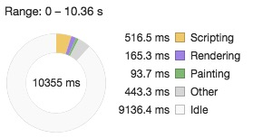

## Prologue

[Omi Framework](https://github.com/Tencent/omi/) Official Release [→ omi-transform](https://github.com/Tencent/omi/tree/master/packages/omi-transform)。

> Made css3 transform super easy.


It is a specific motion solution for developing transform in Omi. It lets you easy and fast to config CSS Transform in an Omi project. First of fall, as for css3transform, css3transform is a mobile web motion solution, and it is using in Wechat and QQ Mobile broadly. Also, it provides functions to **modify** DOM attributes.

Through [css3transform Official Homepage](https://tencent.github.io/omi/packages/omi-transform/css3transform/) you can check it.

The example in an Official Homepage is by Native JS, and there has a React version for css3transform so it can be used css3transform as declarative way of React:

``` js
render() {
    return (
        <Transform
          translateX={100}
          scaleX={0.5}
          originX={0.5}>
          <div>Transform DOM</div>
        </Transform>
    );
}
```

Significant part is an omi-transform.

## omi-transform Master in 3 minutes

### NPM Install

``` js
npm install omi-transform
```

### Usage


```js
import { render, WeElement, define } from "omi"
import "omi-transform"

define("my-app", class extends WeElement {
  install() {
    this.data.rotateZ = 30
    this.linkRef = (e) => {
      this.animDiv = e
    }
  }

  installed() {
    setInterval(() => {
      //slow
      // this.data.rotateZ += 2
      // this.update()

      //fast
      this.animDiv.rotateZ += 2
      //sync for update call of any scenario
      this.data.rotateZ = this.animDiv.rotateZ
    }, 16)
  }

  render(props, data) {
    return (
      <css3-transform rotateZ={data.rotateZ} translateX={0} perspective={0} >
        <div ref={this.linkRef}>
          omi-transform
        </div>
      </css3-transform>
    )
  }
})

render(<my-app />, "body")
```
* Mark `ref` on DOM that needs to use css3transform to manipulate DOM directly
* You can use this.refs.xxx to read or set the css transform property in the component function
* this.refs.xxx supports "translateX", "translateY", "translateZ", "scaleX", "scaleY", "scaleZ", "rotateX", "rotateY", "rotateZ", "skewX", "skewY", "originX", "originY", "originZ", "perspective", and it will be configured and is able to read.
* Without the mark perspective, the perspective projection is not used by default.

A DOM in a omponent may be updated due to other logic udring the movement. There may be user interaction, and it may be a callback for data return. Therefore, before and after the update, the retention of the state of the DOM is particularly important, otherwise there will be refresh, jumping effects or other display logic erros.

Can you see the above code does not perform Diff during DOM motion? Is this mean that the component is not updated?
The meaning is that in the event of component updated. is the state of all motion going to be lost? How does Omi solve this problem?

> Use `this.data.rotateZ` to synchronize the state of the motion DOM to prevent accidental refreshes (`update`).

[→ Demo](https://tencent.github.io/omi/packages/omi/examples/css3transform/)

## Support Property

| **Property**    | **Describe**                           |
| --------- | ---------------------- |
| translateX |translateX |
| translateY |translateY |
| translateZ |translateZ |
| scaleX |scaleX |
| scaleY |scaleY |
| scaleZ |scaleZ|
| rotateX |rotateX |
| rotateY |rotateY |
| rotateZ |rotateZ |
| skewX | skewX|
| skewY |skewY |
| originX |  the basic x point of rotation|
| originY | the basic y point of rotation |
| originZ |  the basic z point of rotation|
| perspective |Perspective projection distance |

You can get and set.

## Performance Comparison

Because React version will have a diff process, and then apply diff to dom process, the state change will not replace the entire innerHTML, so it will still very cheap for browser rendering, but the process of iff in JS still needs to go to profiles. One, if the time is serious, not running in the web worker or stuck in the UI thread will cause the card to be stuck, the interaction is delayed so it is necessary to take a look at the CPU's time consumption.

The following data compares between omi-transform and react-transform, using Chrome Profiles in two ways.

**Total Time Consumption Comparison**：

react-transform：


omi-transform：


- React in 8379ms, CPU took **1686ms** approximately.
- Omi in 9254ms, CPU took **700ms** approximately.

Without Profiles, you can imagine that the React will be slower because the state changes to go through the React Life Cycle, but you can see that the time spent on the React is still acceptable, not too slow to accept.

Omi's approach is exactly the same as the traditional Native JS. I thought that the DOM Diff!!

## Omi Self Comparison

```js
//slow
this.data.rotateZ += 2
this.update()
```

```js
//fast
this.animDiv.rotateZ += 2
this.data.rotateZ = this.animDiv.rotateZ
```

Mainly compare the execution efficiency of the above two code blocks, directly look at the comparison results:

| **Slow**                         | **Fast**                           |
| ------------------------------- | ----------------------------------- |
|  |  |

You can see that Omi has high performance in both ways, with a lot of idel time in 10 seconds, and fast is indeed faster and scripting takes less time, but why is the advantage not obvious? Because the DOM structure is simple, if the DOM structure is more complex, the way that fast directly manipulates the DOM will cut the slow way off!

## Star & Fork

[→ omi-transform](https://github.com/Tencent/omi/tree/master/packages/omi-transform)
