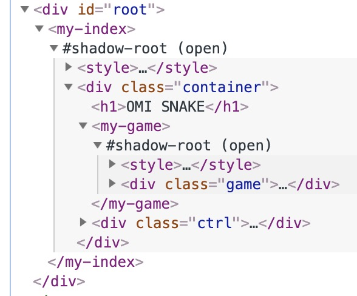
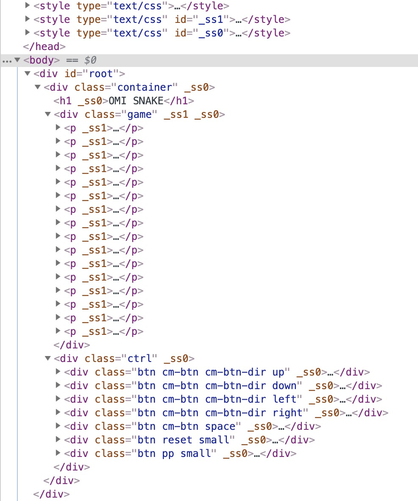

## Snake-Eating Game Making with Web Components of Omi and MVP Architecture 


Actually, I used react, preact, vue and [omi framework](https://github.com/Tencent/omi) to develop this game, and I found that the development experience of Omi is the best, and [the sourece code](https://github.com/Tencent/omi/tree/master/packages/snake) is really neat. Let me take you step by step to develop this simple game.

* [Touch Online Demo(Mobile)](https://tencent.github.io/omi/packages/snake/build/)

Read this article and you can learn:

* Integration of Domain Driven Design in Front End
* Basic Principles of rpx unit of CSS
* Using Omi to develop Snake Eating game
* Understanding MVC, MVP, MVVM patterns
* Use DOM to write small game (not canvas)
* Game Main Frame Rate and Local Frame Rate Control
* Omi store system

### Domain Model Design

* Extract the main entities, such as (snake, game)
* Summarize the specific business attribute methods from entity 
  * Snake
    * Contains the direction of motion, body attributes
    * Contains moving and steering methods
  * Game
    * Contains end pause status, maps, scores, frame rates, game protagonists, food
    * Contains start game, pause game, end game, produce food, reset game, etc.
* Establishing links between entity attribute methods
  * The only protagonist in the game is the snake.
  * Snakes eat food, and game scores increase
  * Food disappears. Game is responsible for producing food again.
  * The snake hits the wall or hits itself, and the game is over.
* Core Loop Logic
  * Judge whether there is food or not and produce one without it (low frame rate)
  * Collision detection between snake and itself
  * Collision detection between snakes and obstacles
  * Collision detection between snake and food
  * Snake movement

### Snake Class

```js
class Snake {
  constructor() {
    this.body = [3, 1, 2, 1, 1, 1]
    this.dir = 'right'
  }

  move(eating) {
    const b = this.body
    if (!eating) {
      b.pop()
      b.pop()
    }

    switch (this.dir) {
      case 'up':
        b.unshift(b[0], b[1] - 1)
        break
      case 'right':
        b.unshift(b[0] + 1, b[1])
        break
      case 'down':
        b.unshift(b[0], b[1] + 1)
        break
      case 'left':
        b.unshift(b[0] - 1, b[1])
        break
    }
  }

  turnUp() {
    if (this.dir !== 'down')
      this.dir = 'up'
  }
  turnRight() {
    if (this.dir !== 'left')
      this.dir = 'right'
  }
  turnDown() {
    if (this.dir !== 'up')
      this.dir = 'down'
  }
  turnLeft() {
    if (this.dir !== 'right')
      this.dir = 'left'
  }
}
```

The snake's turn has a logic that it can't retreat in the opposite direction. For example, it is moving left and can't turn directly right. Therefore, there are corresponding conditional judgments in `turnUp`, `turnRight`, `turnDown`, `turnLeft`.

### Game Class

```js
import Snake from './snake'

class Game {
  constructor() {
    this.map = []
    this.size = 16
    this.loop = null
    this.interval = 500
    this.paused = false
    this._preDate = Date.now()
    this.init()
  }

  init() {

    this.snake = new Snake

    for (let i = 0; i < this.size; i++) {
      const row = []
      for (let j = 0; j < this.size; j++) {
        row.push(0)
      }
      this.map.push(row)
    }
  }

  tick() {

    this.makeFood()
    const eating = this.eat()
    this.snake.move(eating)
    this.mark()

  }

  mark() {
    const map = this.map
    for (let i = 0; i < this.size; i++) {
      for (let j = 0; j < this.size; j++) {
        map[i][j] = 0
      }
    }

    for (let k = 0, len = this.snake.body.length; k < len; k += 2) {
      this.snake.body[k + 1] %= this.size
      this.snake.body[k] %= this.size

      if (this.snake.body[k + 1] < 0) this.snake.body[k + 1] += this.size
      if (this.snake.body[k] < 0) this.snake.body[k] += this.size
      map[this.snake.body[k + 1]][this.snake.body[k]] = 1
    }
    if (this.food) {
      map[this.food[1]][this.food[0]] = 1
    }
  }

  start() {
    this.loop = setInterval(() => {
      if (Date.now() - this._preDate > this.interval) {
        this._preDate = Date.now()
        if (!this.paused) {
          this.tick()
        }
      }
    }, 16)
  }

  stop() {
    clearInterval(this.loop)
  }

  pause() {
    this.paused = true
  }

  play() {
    this.paused = false
  }

  reset() {
    this.paused = false
    this.interval = 500
    this.snake.body = [3, 1, 2, 1, 1, 1]
    this.food = null
    this.snake.dir = 'right'
  }

  toggleSpeed() {
    this.interval === 500 ? (this.interval = 150) : (this.interval = 500)
  }

  makeFood() {
    if (!this.food) {
      this.food = [this._rd(0, this.size - 1), this._rd(0, this.size - 1)]
      for (let k = 0, len = this.snake.body.length; k < len; k += 2) {
        if (this.snake.body[k + 1] === this.food[1]
          && this.snake.body[k] === this.food[0]) {
          this.food = null
          this.makeFood()
          break
        }

      }
    }
  }

  eat() {
    for (let k = 0, len = this.snake.body.length; k < len; k += 2) {
      if (this.snake.body[k + 1] === this.food[1]
        && this.snake.body[k] === this.food[0]) {
        this.food = null
        return true
      }
    }
  }

  _rd(from, to) {
    return from + Math.floor(Math.random() * (to + 1))
  }
}
```

You can see that the above code uses a 16*16 two-dimensional array to store snakes, food, and map information. Snakes and food occupy 1 lattice and the rest 0.

```js
[
  [0, 0, 0, 0, 0, 0, 0, 0, 0, 0, 0, 0, 0, 0, 0, 0],
  [0, 0, 0, 0, 0, 0, 0, 0, 0, 0, 0, 0, 0, 0, 0, 0],
  [0, 0, 1, 1, 1, 0, 0, 0, 0, 0, 0, 0, 0, 0, 0, 0],
  [0, 0, 0, 0, 1, 1, 0, 0, 0, 0, 0, 0, 0, 0, 0, 0],
  [0, 0, 0, 0, 0, 0, 0, 0, 0, 0, 0, 0, 0, 0, 0, 0],
  [0, 0, 0, 0, 0, 0, 0, 0, 0, 0, 0, 0, 0, 0, 0, 0],
  [0, 0, 0, 0, 0, 0, 0, 0, 0, 0, 0, 0, 0, 0, 0, 0],
  [0, 0, 0, 0, 0, 0, 0, 0, 0, 0, 0, 0, 0, 0, 0, 0],
  [0, 0, 0, 0, 0, 0, 0, 1, 0, 0, 0, 0, 0, 0, 0, 0],
  [0, 0, 0, 0, 0, 0, 0, 0, 0, 0, 0, 0, 0, 0, 0, 0],
  [0, 0, 0, 0, 0, 0, 0, 0, 0, 0, 0, 0, 0, 0, 0, 0],
  [0, 0, 0, 0, 0, 0, 0, 0, 0, 0, 0, 0, 0, 0, 0, 0],
  [0, 0, 0, 0, 0, 0, 0, 0, 0, 0, 0, 0, 0, 0, 0, 0],
  [0, 0, 0, 0, 0, 0, 0, 0, 0, 0, 0, 0, 0, 0, 0, 0],
  [0, 0, 0, 0, 0, 0, 0, 0, 0, 0, 0, 0, 0, 0, 0, 0],
  [0, 0, 0, 0, 0, 0, 0, 0, 0, 0, 0, 0, 0, 0, 0, 0]
]
```

So it represents a snake of five lengths and a food. Can you find it in the gird above?

### Game Panel Rendering

```jsx
import { define, rpx } from 'omi'

define('my-game', ['map'], _ => (
  <div class="game">
    {_.store.data.map.map(row => {
      return <p>
        {row.map(col => {
          if (col) {
            return <b class='s'></b>
          }
          return <b></b>
        })}
      </p>
    })}
  </div>
), rpx(require('./_index.css')))
```

The cell with `s` class is black, such as food, snake body, and the rest will be grey background. The `['map']` represents a dependency on `store.data`. The `map` updates automatically update views.

### Ctrl and Game Panel Rendering

```jsx

import { define, rpx } from 'omi'
import '../game'


define('my-index', ['paused'], ({store}) => (
  <div class="container">
    <h1>OMI SNAKE</h1>

    <my-game></my-game>

    <div class="ctrl">
      <div class="btn cm-btn cm-btn-dir up" onClick={store.turnUp}><i></i><em></em><span>Up</span></div>
      <div class="btn cm-btn cm-btn-dir down" onClick={store.turnDown}><i></i><em></em><span>Down</span></div>
      <div class="btn cm-btn cm-btn-dir left" onClick={store.turnLeft}><i></i><em></em><span >Left</span></div>
      <div class="btn cm-btn cm-btn-dir right" onClick={store.turnRight}><i></i><em></em><span >Right</span></div>
      <div class="btn cm-btn space" onClick={store.toggleSpeed}><i></i><span >加速/减速</span></div>
      <div class="btn reset small" onClick={store.reset}><i ></i><span >Reset</span></div>
      <div class="btn pp small" onClick={store.pauseOrPlay}><i></i><span >{store.data.paused ? 'Play' : 'Pause'}</span></div>
    </div>
  </div>

), rpx(require('./_index.css')))
```

### Define the Store 

```js
import Game from '../models/game'

const game = new Game
const { snake, map } = game

game.start()

export default {
  data: {
    map
  },
  turnUp() {
    snake.turnUp()
  },
  turnRight() {
    snake.turnRight()
  },
  turnDown() {
    snake.turnDown()
  },
  turnLeft() {
    snake.turnLeft()
  },
  pauseOrPlay() {
    if (game.paused) {
      game.play()
    } else {
      game.pause()
    }
  },
  reset() {
    game.reset()
  },
  toggleSpeed() {
    game.toggleSpeed()
  }
}
```

You'll find that the store is thin and only responsible for transiting View action to Model and for automatically mapping data from Model to View.

### Frame Rate Control

How to control the main frame rate and the local frame rate? In general, we think that 60 FPS is fluent, so we have a 16 ms interval between timers. The smaller the amount of computation in the core cycle, the closer to 60 FPS:


```js
this.loop = setInterval(() => {
  //
}, 16)
```

However, some computations do not need to be computed once in 16 seconds, which reduces the frame rate, so the last execution time can be recorded to control the frame rate:


```js
this.loop = setInterval(() => {
    //60 FPS
  if (Date.now() - this._preDate > this.interval) {
    //1000/this.interval FPS
    this._preDate = Date.now()
    if (!this.paused) {
      //Core Loop Logic
      this.tick()
    }
  }
}, 16)
```

You can use [raf-interval](https://github.com/dntzhang/raf-interval) base on `requestAnimationFrame` instead of `setInterval` to improve performance:

```js
this.loop = setRafInterval(() => {
  //60 FPS
  if (Date.now() - this._preDate > this.interval) {
    //1000/this.interval FPS
    this._preDate = Date.now()
    if (!this.paused) {
      //Core Loop Logic
      this.tick()
    }
  }
}, 16)
```

### File directory description

```
├─ build           //Compiled files for production environments
├─ config
├─ public
├─ scripts
├─ src
│  ├─ assets
│  ├─ components    //Components that store all view of pages
│  ├─ models        //Store all models
│  ├─ stores        //Store all store
│  └─ index.js      //The entry file will be built into index.html
```

So MVC, MVP or MVVM?

From the snake-eating source code, we can see that the view(components) and the model are separated, and there is no interdependence. But in MVC, the view depends on the model and the coupling degree is too high, which leads to the greatly reduced portability of the view, so it must not be MVC architecture.


In MVP mode, views do not depend directly on models, and Presenter is responsible for completing the interaction between Models and Views. MVVM and MVP are similar. ViewModel plays the role of Presenter and provides the data source needed for UI view, instead of directly letting View use the data source of Model. This greatly improves the portability of View and Model, such as using Flash, HTML, WPF rendering for the same model switch, such as using different models for the same View. As long as the Model and ViewModel are mapped well, View can be changed very little or not.


From the snake source code, we can see that the data attribute of Presenter (stores) is directly used to render in View (components). The data attribute comes from the attribute of Model(models), and there is no mapping between Model and ViewModel. So it must not be MVVM architecture.


So the snake above belongs to **MVP**! It's just an evolutionary version of MVP, because the `map` changes in M will be more customized than View, and the loop from M - > P - > V is automated, and there is no logic in the code. Simply declare dependency:

```js
define('my-game', ['map'] ...
```

This also avoids the biggest problem of MVVM: the overhead of M-to-VM mapping.

You can also change data in the store and it will automatically update views:

```js
  pauseOrPlay = () => {
    if (game.paused) {
      game.play()
      //auto update view
      this.data.paused = false
    } else {
      game.pause()
      //auto update view
      this.data.paused = true
    }
  }
```

Because of:

```js
define('my-index', ['paused'], ...
```

### Evolutionary MVP Advantages

1. Reusability

Decoupling between Model and View, change of one side of Model or View, unchanged Presenter interface, and change of the other side is unnecessary, so the business logic of Model layer has good flexibility and reusability.

2. Flexibility

Presenter's data changes are automatically mapped to views, making Presenter thin and thin, and View is a passive view. And Presenter-based data can be rendered using any platform, any framework, any technology.

3. Testability

If there is tight coupling between View and Model, it is impossible to test one of them before the simultaneous development of Model and View is completed. For the same reason, unit testing of View or Model is difficult. Now, the MVP model solves all the problems. In MVP mode, there is no direct dependency between View and Model, and developers can test either of them by injecting simulated objects.

### CSS rpx unit

Rpx (responsive pixel) is a unit invented by wxss in wechat mini programe: it can be adapted according to the width of the screen. Set the screen width to 750 rpx. For example, on the iPhone 6, the screen width is 375 px, with 750 physical pixels, 750 rpx = 375 PX = 750 physical pixels, and 1 rpx = 0.5 PX = 1 Physical pixel.

| **Device**                         | **rpx to px (screenwidth/750)**        | 	px to rpx (750/screenwidth) |
| ------------------------------- | ----------------------------------- | ---------------------|
| iPhone5 | 	1rpx = 0.42px | 1px = 2.34rpx|
| iPhone6 | 	1rpx = 0.5px | 1px = 2rpx|	
| iPhone6 Plus | 	1rpx = 0.552px | 1px = 1.81rpx |

Rpx unit is very conducive to the overall workflow of front-end development, because the designer's design draft is designed according to the width of 750, so the front-end page can directly use sketch export ruler for rpx layout.

Rpx can also be used for web development.

### rpx principle    

Because the device width can only be known at runtime, the mapping of rpx to PX needs to be calculated dynamically at runtime.

```js
export function rpx(css) {
  return css.replace(/([1-9]\d*|0)(\.\d*)*rpx/g, (a, b) => {
    return (window.innerWidth * Number(b)) / 750 + 'px'
  })
}
```
### HTML structure screenshot



### Compatibility

The last 2 versions of all modern browsers are supported, including Chrome, Safari, Opera, Firefox, Edge. In addition, Internet Explorer 11 is also supported.

Edge and Internet Explorer 11 require the web components polyfills.

If you want to be compatible with **IE8+**, Change one line in the package.json:

```json
  "alias": {
    "omi": "omio"
  }
```

> Omio - Omi for old browsers with same api of omi(IE8+)

HTML structure screenshot by omio:



### Links

* [Game Source Code](https://github.com/Tencent/omi/tree/master/packages/snake)
* [Omi Github](https://github.com/Tencent/omi)
* [Omi Store System](https://tencent.github.io/omi/site/docs/index.html#/store?index=1&subIndex=8)
